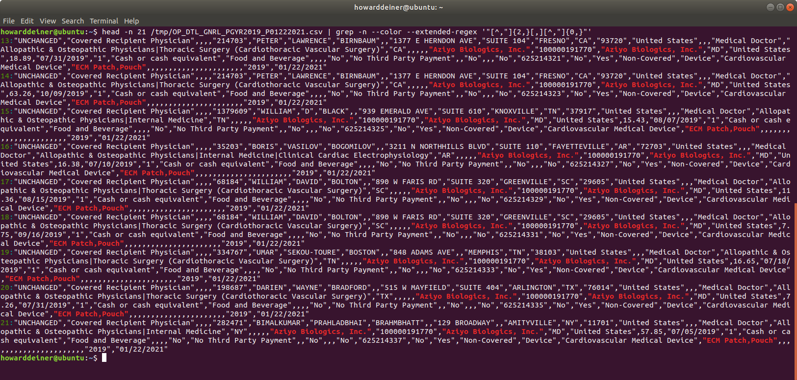
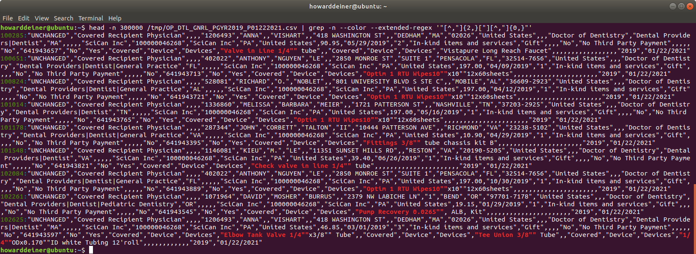
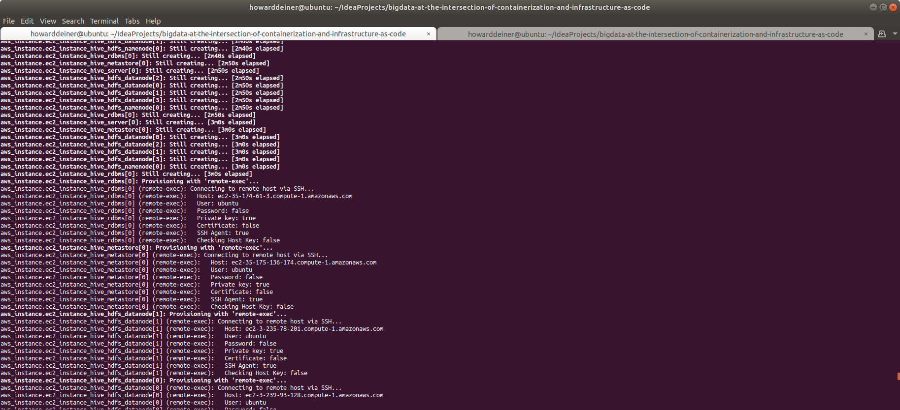

# Big Data at the Intersection of Continerization and Infrastructure as Code

## Concept

This repository started out as a real world problem I faced recently.  Our group knew that it needed to start supporting Apache Hive on Hadoop Clusters.  Unhappily, they knew nothing about Hadoop nor Apache Hive.  

One possibility was for people to start using the AWS Console and start creating AWS EMR (the Amazon managed cluster platform for supporting Hadoop, Map/Reduce, Apache Hive, etc.) instances.  What could go wrong?  Well, how about everything, even if the instructions were followed to a tee.

I was very much against that idea, since we would not be learning anything, and would be reduced to mere users of a vendor-centric solution that would increase our cost of switching should we wish to change Cloud providers.

Instead, I showed the group to learn to run on Docker Desktop orchestrated instances (docker-compose), and gave them Terraform scripts to create clusters in the AWS Cloud, which could be easily customized to our needs using the IaC (Infrastructure as Code) concepts embodied by Terraform.

We face grave dangers when we simply use a pre-canned solution to our immediate problems.  When we don't understand the underlying principles of what we create, we are at the mercy of "Cargo Culting" in our solutions.  (See https://en.wikipedia.org/wiki/Cargo_cult_programming and https://en.wikipedia.org/wiki/Cargo_cult_science for more background on this tantilizing subject.)

We don't have to become experts at the underlying priciples and practices.  But we do need some background to gain perspective and help us through the swirling solution waters.

Another example of this principle is in Machine Learning.  Most people jump directly into solutions like TensorFlow/Keras, and quickly generate models to distinguish photos of hot dogs from photos of cats by "clipboard inheritance" (copy/paste).  But the minute that we are asked to do something more challenging, like distinguish cancerous cells from normal cells in a photomicrograph, we are completely stuck, and with no background to draw upon, we resort to asking around to see what other people have used for training models.  That's why books like "Neural Networks from Scratch" (https://nnfs.io) are important.  We need to understand the subject before we can progress and help extend the frameworks to help us on our journey to add value.   

The real problem that my team faced was that they got their orders from people who only wanted a complete solution that they heard or read about from people who had no background in the subject matter.  They were told the equivalent of "Do this one simple thing and cure your tinnitus forever!"  I'm not an expert on tinnitus, but I'm sure that without understanding the underlying cause and the relationship to your total well being, your chances for immediate and complete cure are about zero.  Audiolosists and otolaryngologists spend lifetimes continually learning.  Why should that be different than people who practice in the computer sciences arena?

We can take some inspiration from Richard Feynman’s blackboard at time of his death.  He was that crazy Caltech professor who worked on the Manhattan project to build the first nuclear bomb, won a Nobel prize, and solved the "O-Ring" problem on the Space Shuttle Challenger disaster.  He's also the same guy credited with popularizing the concept of "cargo culting."  Let's take a look at his blackboard right after his death.  In the upper left corner, where we place the most important things we want to remember, it looked like this:

My take on that is that memorizing physics formulas is hopeless in the long run, and that by knowing a few key things and understanding the principles, you can work out whatever details you need.  

And so it is with very complicated software frameworks.  We'll never understand the thing we desire without building it from just a few key principles.  And once we can build it, we can know how to solve all the problems in that domain by doing them if they are not obvious.  That's why we start where we start today.

## How We Will Proceed

We need to keep our goal in mind.  Print it in big letters and paste it on the wall viewable at the top of your monitor if need be.  For this project, we are looking to help people self-provision their own Apache Hive environments for both their desktops and in Clouds, so they can use large datasets and perform SQL-like operations for data that resides in Apache Hadoop Clusters.

To that end, we need to experience some of their issues so that we can empathize with their needs, wants, desires, and pains.

<ol>
<li>To begin, we need some data to work from.  Our users may be worried about petabytes or exabytes of data, but to get started, how about we start with known data in the gigabyte range?</li>
<li>Then, we'll have to worry about data cleansing, so the data we import into our dataset can be used easily, without issue for import or querying against.</li>
<li>Next, it would be nice to start using conatinerization, to allow us to quickly "install" the components to our local machines and test out what we will be doing.  There, we can we gain enough experience to issue commands for things like importing and querying the data, as well as monitoring the components like Hadoop and Hive.  I choose to use Docker for this, because we don't have to install to our systems.  We use Docker Containers to create environments on demand, and installlaion and modification doesn't affect our host environments.</li>
<li>When we're comfortable that we understand the components and how they work together, we can then use Infrastruture as Code to create the scripts that permit us to create, provision, and test the installations in our ultimate Cloud environments.</li>
</ol>

## A Walk Through the Code

### Getting Data and Cleaning It Up

We'd like a simple and easily available dataset.  Luckily, the US Government has many such datasets publically available.  

I happened upon the Center for Medicare and Medicaid services, and their "Complete 2019 Program Year Open Payments Dataset", which is described at https://www.cms.gov/OpenPayments/Explore-the-Data/Dataset-Downloads as "A complete set of all data from the 2019 Program Year, which includes data reported about payments made from January 1 through December 31, 2019."  I have download the "CMS Open Payments Public Use Files - Methodology and Data Dictionary Document.pdf" in this repository, so you can view all of the data in it.

The dataset itself consists of 10,347,917 records stored as a csv file, taking 5.7GB of space.

As is the case with most relational database systems, Apache Hive provides a utility to declare a schema to the data and import the csv file to the database.

Here's a sample of what the raw data looks like:


As you can see, this is very standard quoted style csv.  Most database systems have no issues processing that csv into the database.  Unhappily, Apache Hive can't work with quoted csv data.  This means lots of trouble in cleaning things up.

For example, you have embedded commas in that quoted data, as in:


There are also issues with converting the dates in the csv data into valid TIMESTAMP dates for Apache Hive and metastore database used for Apache Hive (I will be using Postgresql for metadata storage).  So, the normal processing on csv import can't be done.  Here's an example of that issue:


So, I decided to write the Python program create_PGYR2019_P06302020_csv_data.py to handle
<UL>
<LI>Downloading the dataset to a /tmp location</LI>
<LI>Unzipping the downloaded dataset</LI>
<LI>Parsing the downloaded dataset into a vanilla csv file to be used further down the line</LI>
</UL>

Here's the final result from running the Python program on the console:\


And here's what my nice clean csv file at /tmp/PGYR19_P012221/bigdata.csv looks like:\


### Learning About Apache Hive by Running in Docker Containers

One might think that the next thing to do is start instancing AWS instances, installing stuff, configuring, and debugging everything.  I think that's a huge mistake.  Especially if just about the only thing you know about Apache Hive is how to spell Hive.  It's far better to familiar with the things you don't know in a Docker Container environment.  Because, that way, 
<UL>
<LI>You can learn about installation of the various components without destroying your environment.</LI>
<LI>The cycle time to go from scratch to experiment is <I>significantly</I> quicker.  Starting up a container is orders of magnitude quicker than instancing a machine (cloud or otherwise).</LI>
<LI>You create an environment that may not be capable of running with as much data, clustered instances, etc, but you are in an environment where you can learn about:</LI>
<UL>
<LI>Commands that will run in your final setting</LI>
<LI>How to write and deploy applications, such as smoke tests, to verify that your environment is operational</LI>
<LI>How to quickly demo the solution, with limitations, to people</LI>
<LI>How to easily share the knowledge about what you're learning with others in the repository you use</LI>
<LI>You can concentrate on learning the frameworks, and perhaps not have concentrate on the installation of the frameworks, because so many Docker ready images already exist</LI>
</UL>
</UL>

People talk about the importance of shared space to enable collaboration and build high performing teams.   While I think that's great, I fully believe that <I>true</I> software collaboration occurs when you share your code with others, and it reliably works for the person you share it with.  Too many times, demos are fleeting, transitory, and non-repeatable.  You don't want to be Fleischmann and Pons, touting that you can achieve cold fusion (https://en.wikipedia.org/wiki/Cold_fusion), and just publicize your great achievements.  Unless and until you have repeatable results, all that you have is a glimpse of what you may be able to do.  

This is especially relevant at the time of writing this, due to restrictions due to COVID-19 on working together in a face-to-face environment.  Your repository should be your primary mode of sharing with your teams, not some Zoom or WebEx desktop share.

So, what's the quickest way to get started?  I felt that for the situation that I was embarking on, my easiest entrypoint was "Big Data Europe" (https://www.big-data-europe.eu).  This was started in 2015 as "... a project within the EU’s “Horizon 2020” framework program, which aims to build a knowledge and innovation based society so as to strengthen the competitiveness of Europe’s economy."  While they are focussed on the use of big data to drive competitiveness, they also maintain a wonderful set of GitHub repositories at https://github.com/big-data-europe and a corresponding set of DockerHub iamge repositories at https://hub.docker.com/u/bde2020 that allow one to try out try out different sets of open source big data projects and mix together a solution to one's liking.

For a coach like myself, who actually knows something about the topic, but wants to get my students quickly into learning, providing them a single docker-compose.yml file that they can then easily run gives me the best of all worlds.  I can now provide a single file, with very simple instructions, and give them an environment to learn in.

We want to create an environment that looks like this:\


And we can implement that, using the Docker code from Big Data Europe, as
```yml
version: "3"

services:
  namenode:
    image: bde2020/hadoop-namenode:2.0.0-hadoop2.7.4-java8
    container_name: namenode
    volumes:
      - namenode:/hadoop/dfs/name
    environment:
      - CLUSTER_NAME=test
    env_file:
      - ./hadoop-hive.env
    ports:
      - "50070:50070"
  datanode:
    image: bde2020/hadoop-datanode:2.0.0-hadoop2.7.4-java8
    container_name: datanode
    volumes:
      - datanode:/hadoop/dfs/data
    env_file:
      - ./hadoop-hive.env
    environment:
      SERVICE_PRECONDITION: "namenode:50070"
    ports:
      - "50075:50075"
  hive-server:
    image: bde2020/hive:2.3.2-postgresql-metastore
    container_name: hive-server
    env_file:
      - ./hadoop-hive.env
    environment:
      HIVE_CORE_CONF_javax_jdo_option_ConnectionURL: "jdbc:postgresql://hive-metastore/metastore"
      SERVICE_PRECONDITION: "hive-metastore:9083"
    ports:
      - "10000:10000"
  hive-metastore:
    image: bde2020/hive:2.3.2-postgresql-metastore
    container_name: hive-metastore
    env_file:
      - ./hadoop-hive.env
    command: /opt/hive/bin/hive --service metastore
    environment:
      SERVICE_PRECONDITION: "namenode:50070 datanode:50075 hive-metastore-postgresql:5432"
    ports:
      - "9083:9083"
  hive-metastore-postgresql:
    image: bde2020/hive-metastore-postgresql:2.3.0
    container_name: hive-metastore-postgresql
    volumes:
      - postgresql:/var/lib/postgresql/data

volumes:
  namenode:
  datanode:
  postgresql:
```
Not only will people now have an environment to learn in, but they can learn, by examing the Big Data Europe repositories, what one would have to install to replicate the results without using Docker.  <I>Note: I am not making any comment on whether one might want to use Docker to actually run production data in a Cloud setting.  It is a perfectly reasonable thing to do, and in fact, it seems that BDE anticipates Docker Swarm deployments with customized yml for swarm deployments for things like clustered HADOOP.</I>

So, to make this happen, in addition to the docker-compose.yml, we are going to have to configure the Docker services to be aware of each other.  This exercise will serve us well when it comes times to replace the relatively simple endpoints of the services in a Docker Compose environment (using the container names) to the actual endpoints in the actual AWS EC2 instances.  We get to understand the endpoints and the ports to communicate with.  All of that is housed in a convenient hadoop-hive.env file for us here.
```properties
HIVE_SITE_CONF_javax_jdo_option_ConnectionURL=jdbc:postgresql://hive-metastore-postgresql/metastore
HIVE_SITE_CONF_javax_jdo_option_ConnectionDriverName=org.postgresql.Driver
HIVE_SITE_CONF_javax_jdo_option_ConnectionUserName=hive
HIVE_SITE_CONF_javax_jdo_option_ConnectionPassword=hive
HIVE_SITE_CONF_datanucleus_autoCreateSchema=false
HIVE_SITE_CONF_hive_metastore_uris=thrift://hive-metastore:9083
HDFS_CONF_dfs_namenode_datanode_registration_ip___hostname___check=false

CORE_CONF_fs_defaultFS=hdfs://namenode:8020
CORE_CONF_hadoop_http_staticuser_user=root
CORE_CONF_hadoop_proxyuser_hue_hosts=*
CORE_CONF_hadoop_proxyuser_hue_groups=*

HDFS_CONF_dfs_webhdfs_enabled=true
HDFS_CONF_dfs_permissions_enabled=false

YARN_CONF_yarn_log___aggregation___enable=true
YARN_CONF_yarn_resourcemanager_recovery_enabled=true
YARN_CONF_yarn_resourcemanager_store_class=org.apache.hadoop.yarn.server.resourcemanager.recovery.FileSystemRMStateStore
YARN_CONF_yarn_resourcemanager_fs_state___store_uri=/rmstate
YARN_CONF_yarn_nodemanager_remote___app___log___dir=/app-logs
YARN_CONF_yarn_log_server_url=http://historyserver:8188/applicationhistory/logs/
YARN_CONF_yarn_timeline___service_enabled=true
YARN_CONF_yarn_timeline___service_generic___application___history_enabled=true
YARN_CONF_yarn_resourcemanager_system___metrics___publisher_enabled=true
YARN_CONF_yarn_resourcemanager_hostname=resourcemanager
YARN_CONF_yarn_timeline___service_hostname=historyserver
YARN_CONF_yarn_resourcemanager_address=resourcemanager:8032
YARN_CONF_yarn_resourcemanager_scheduler_address=resourcemanager:8030
YARN_CONF_yarn_resourcemanager_resource__tracker_address=resourcemanager:8031
```

So, with that in mind, and the previous two files behind us, here's the bash script to start up an Apache Hive environment, called 02_continerized_hive_startup:
```bash
#!/usr/bin/env bash
echo "$(tput bold)$(tput setaf 6)Startup Apache Hive Locally$(tput sgr 0)"

docker-compose -f docker-compose.yml up -d

echo "$(tput bold)$(tput setaf 6)Wait for Hive to start$(tput sgr 0)"
while true ; do
  docker logs hive-server > stdout.txt 2> stderr.txt
  result=$(grep -cE " Starting HiveServer2" stdout.txt)
  if [ $result != 0 ] ; then
    sleep 10 # it says it is ready, but not really
    echo "$(tput bold)$(tput setaf 2)Hive has started$(tput sgr 0)"
    break
  fi
  sleep 5
done
rm stdout.txt stderr.txt
```
Note that we want to keep any scripts from executing by waiting for Hive to indicate that it's starting.  But there always is some judgement call in all of this.

What the console looks like:\


Well, that looks fine, but how do we know anything useful happened?

Here's the ps for Docker right now:\


And that looks good as well.  How about looking at the service logs?

Here's the beginning and the end of the logs for the namenode service:\


For the datanode service:\


For the hive-metastore-postgresql service:\


For the hive-metastore service:\


And, finally, for the hive-server service:\


We're not going to go line by line through the logs, but even at a glance you can see that while starting up your service, you have to wait for your depended upon services to start.

So, fine.  It appeards that the services have started.  How about a small smoke test?  In the world of C, the quintessential smoke test is "Hello World".  Everyone has seen it.
````java
#include <stdio.h>

main()
{
    printf("hello, world\n");
}
````
We're just testing that the C compiler can output a known string to the console.  That could be a huge vote of confidence that the C compiler and the supporting infrastructure is working.

But what about Hadoop and Map/Reduce?  To quote from Apache on what Hadoop and Map/Reduce is (as a reminder), 

> Hadoop MapReduce is a software framework for easily writing applications which process vast amounts of data (multi-terabyte data-sets) in-parallel on large clusters (thousands of nodes) of commodity hardware in a reliable, fault-tolerant manner.
>
> A MapReduce job usually splits the input data-set into independent chunks which are processed by the map tasks in a completely parallel manner. The framework sorts the outputs of the maps, which are then input to the reduce tasks. Typically both the input and the output of the job are stored in a file-system. The framework takes care of scheduling tasks, monitoring them and re-executes the failed tasks.
> 
> Typically the compute nodes and the storage nodes are the same, that is, the MapReduce framework and the Hadoop Distributed File System (see HDFS Architecture Guide) are running on the same set of nodes. This configuration allows the framework to effectively schedule tasks on the nodes where data is already present, resulting in very high aggregate bandwidth across the cluster.
>
> The MapReduce framework consists of a single master JobTracker and one slave TaskTracker per cluster-node. The master is responsible for scheduling the jobs' component tasks on the slaves, monitoring them and re-executing the failed tasks. The slaves execute the tasks as directed by the master.
>
> Minimally, applications specify the input/output locations and supply map and reduce functions via implementations of appropriate interfaces and/or abstract-classes. These, and other job parameters, comprise the job configuration. The Hadoop job client then submits the job (jar/executable etc.) and configuration to the JobTracker which then assumes the responsibility of distributing the software/configuration to the slaves, scheduling tasks and monitoring them, providing status and diagnostic information to the job-client.

So, the So, for Hadooop, the quintessential "Hello World" program look like this:
````java
import org.apache.hadoop.conf.Configuration;
import org.apache.hadoop.fs.Path;
import org.apache.hadoop.io.IntWritable;
import org.apache.hadoop.io.Text;
import org.apache.hadoop.mapreduce.Job;
import org.apache.hadoop.mapreduce.Mapper;
import org.apache.hadoop.mapreduce.Reducer;
import org.apache.hadoop.mapreduce.lib.input.FileInputFormat;
import org.apache.hadoop.mapreduce.lib.output.FileOutputFormat;

import java.io.IOException;
import java.util.StringTokenizer;

public class WordCount {

    public static class TokenizerMapper
            extends Mapper<Object, Text, Text, IntWritable>{

        private final static IntWritable one = new IntWritable(1);
        private Text word = new Text();

        public void map(Object key, Text value, Context context
        ) throws IOException, InterruptedException {
            StringTokenizer itr = new StringTokenizer(value.toString());
            while (itr.hasMoreTokens()) {
                word.set(itr.nextToken());
                context.write(word, one);
            }
        }
    }

    public static class IntSumReducer
            extends Reducer<Text,IntWritable,Text,IntWritable> {
        private IntWritable result = new IntWritable();

        public void reduce(Text key, Iterable<IntWritable> values,
                           Context context
        ) throws IOException, InterruptedException {
            int sum = 0;
            for (IntWritable val : values) {
                sum += val.get();
            }
            result.set(sum);
            context.write(key, result);
        }
    }

    public static void main(String[] args) throws Exception {
        Configuration conf = new Configuration();
        Job job = Job.getInstance(conf, "word count");
        job.setJarByClass(WordCount.class);
        job.setMapperClass(TokenizerMapper.class);
        job.setCombinerClass(IntSumReducer.class);
        job.setReducerClass(IntSumReducer.class);
        job.setOutputKeyClass(Text.class);
        job.setOutputValueClass(IntWritable.class);
        FileInputFormat.addInputPath(job, new Path(args[0]));
        FileOutputFormat.setOutputPath(job, new Path(args[1]));
        System.exit(job.waitForCompletion(true) ? 0 : 1);
    }
}
````
It parses the input files for words, stores them in Hadoop, and map/reduces a count.

So, let's see the inputs and the outputs.

WordCountTestMrInput01.txt
```txt
time flies like an arrow
```
WordCountTestMrInput02.txt
```txt
fruit flies like a banana
```
WordCountTestMrInput03.txt
```txt
Rose rose to put rose roes on her rows of roses
```
WordCountTestMrAnswer.txt (the "word count" result)
```txt
Rose 1
a 1
an 1
arrow 1
banana 1
flies 2
fruit 1
her 1
like 2
of 1
on 1
put 1
roes 1
rose 2
roses 1
rows 1
time 1
to 1

```
The bash script that will run the WordCount test (runs on the namenode service):
```bash
#!/usr/bin/env bash

export TERM=xterm
echo "$(tput bold)$(tput setaf 6)Test Map/Reduce$(tput sgr 0)"

cd /tmp

export HADOOP_CLASSPATH=${JAVA_HOME}/lib/tools.jar
hadoop com.sun.tools.javac.Main WordCount.java
jar cf wc.jar WordCount*.class

echo "$(tput setaf 6)Inputs$(tput sgr 0)"
cat file01 ; echo ""
cat file02 ; echo ""
cat file03 ; echo ""

hdfs dfs -rm -r /usr/joe/wordcount/input > /dev/null 2> /dev/null
hdfs dfs -mkdir -p /usr/joe/wordcount/input
hdfs dfs -put file01 /usr/joe/wordcount/input/file01
hdfs dfs -put file02 /usr/joe/wordcount/input/file02
hdfs dfs -put file03 /usr/joe/wordcount/input/file03

hadoop jar wc.jar WordCount /usr/joe/wordcount/input /usr/joe/wordcount/output 2> /dev/null

echo "$(tput setaf 6)Outputs$(tput sgr 0)"
rm -rf mr.txt
hdfs dfs -cat /usr/joe/wordcount/output/part-r-00000
hdfs dfs -copyToLocal /usr/joe/wordcount/output/part-r-00000 mr.txt

sed --in-place 's/\t/ /g' mr.txt

result=$(diff mr.txt mr.answer | wc -l)
if [ $result == 0 ] ; then
  echo "$(tput bold)$(tput setaf 2)Test Hadoop Map/Reduce SUCCESS$(tput sgr 0)"
else
  echo "$(tput bold)$(tput setaf 1)Test Hadoop Map/Reduce FAILURE$(tput sgr 0)"
  diff mr.txt mr.answer
fi
```
And finally, the bash script which runs locally to orchestrate everything inside the namenode service, 03_containerized_hadoop_smoke_test.sh
```bash
#!/usr/bin/env bash

docker cp WordCount.java namenode:/tmp/WordCount.java
docker cp WordCountTest.sh namenode:/tmp/WordCountTest.sh
docker cp WordCountTestMrInput01.txt namenode:/tmp/file01
docker cp WordCountTestMrInput02.txt namenode:/tmp/file02
docker cp WordCountTestMrInput03.txt namenode:/tmp/file03
docker cp WordCountTestMrAnswer.txt namenode:/tmp/mr.answer
docker exec namenode /tmp/WordCountTest.sh
```
The console, when 03_containerized_hadoop_smoke_test.sh is run:\


And just to keep us honest, we should make sure that 03_containerized_hadoop_smoke_test.sh captures failures as well when run. I changed the count of flies in WordCountTestMrAnswer from 2 to 1.txt :\


So, far, so good.  But we are actually doing this for Apache Hive!  So, let's test that as well.

To get started, we're going to need a schema for our data.  Convenentlly, I put that in 
```sql
CREATE TABLE IF NOT EXISTS PGYR2019_P06302020(change_type VARCHAR(20),covered_recipient_type VARCHAR(50),teaching_hospital_ccn VARCHAR(6),teaching_hospital_id INT,teaching_hospital_name VARCHAR(100),physician_profile_id INT,physician_first_name VARCHAR(20),physician_middle_name VARCHAR(20),physician_last_name VARCHAR(35),physician_name_suffix VARCHAR(5),recipient_primary_business_street_address_line1 VARCHAR(55),recipient_primary_business_street_address_line2 VARCHAR(55),recipient_city VARCHAR(40),recipient_state VARCHAR(2),recipient_zip_code VARCHAR(10),recipient_country VARCHAR(100),recipient_province VARCHAR(20),recipient_postal_code VARCHAR(20),physician_primary_type VARCHAR(100),physician_specialty VARCHAR(300),physician_license_state_code1 VARCHAR(2),physician_license_state_code2 VARCHAR(2),physician_license_state_code3 VARCHAR(2),physician_license_state_code4 VARCHAR(2),physician_license_state_code5 VARCHAR(2),submitting_applicable_manufacturer_or_applicable_gpo_name VARCHAR(100),applicable_manufacturer_or_applicable_gpo_making_payment_id VARCHAR(12),applicable_manufacturer_or_applicable_gpo_making_payment_name VARCHAR(100),applicable_manufacturer_or_applicable_gpo_making_payment_state VARCHAR(2),applicable_manufacturer_or_applicable_gpo_making_payment_countr VARCHAR(100),total_amount_of_payment_usdollars DECIMAL,date_of_payment TIMESTAMP,number_of_payments_included_in_total_amount INT,form_of_payment_or_transfer_of_value VARCHAR(100),nature_of_payment_or_transfer_of_value VARCHAR(200),city_of_travel VARCHAR(40),state_of_travel VARCHAR(2),country_of_travel VARCHAR(100),physician_ownership_indicator VARCHAR(3),third_party_payment_recipient_indicator VARCHAR(50),name_of_third_party_entity_receiving_payment_or_transfer_of_val VARCHAR(50),charity_indicator VARCHAR(3),third_party_equals_covered_recipient_indicator VARCHAR(3),contextual_information VARCHAR(500),delay_in_publication_indicator VARCHAR(3),record_id INT,dispute_status_for_publication VARCHAR(3),related_product_indicator VARCHAR(100),covered_or_noncovered_indicator_1 VARCHAR(100),indicate_drug_or_biological_or_device_or_medical_supply_1 VARCHAR(100),product_category_or_therapeutic_area_1 VARCHAR(100),name_of_drug_or_biological_or_device_or_medical_supply_1 VARCHAR(500),associated_drug_or_biological_ndc_1 VARCHAR(100),covered_or_noncovered_indicator_2 VARCHAR(100),indicate_drug_or_biological_or_device_or_medical_supply_2 VARCHAR(100),product_category_or_therapeutic_area_2 VARCHAR(100),name_of_drug_or_biological_or_device_or_medical_supply_2 VARCHAR(500),associated_drug_or_biological_ndc_2 VARCHAR(100),covered_or_noncovered_indicator_3 VARCHAR(100),indicate_drug_or_biological_or_device_or_medical_supply_3 VARCHAR(100),product_category_or_therapeutic_area_3 VARCHAR(100),name_of_drug_or_biological_or_device_or_medical_supply_3 VARCHAR(500),associated_drug_or_biological_ndc_3 VARCHAR(100),covered_or_noncovered_indicator_4 VARCHAR(100),indicate_drug_or_biological_or_device_or_medical_supply_4 VARCHAR(100),product_category_or_therapeutic_area_4 VARCHAR(100),name_of_drug_or_biological_or_device_or_medical_supply_4 VARCHAR(500),associated_drug_or_biological_ndc_4 VARCHAR(100),covered_or_noncovered_indicator_5 VARCHAR(100),indicate_drug_or_biological_or_device_or_medical_supply_5 VARCHAR(100),product_category_or_therapeutic_area_5 VARCHAR(100),name_of_drug_or_biological_or_device_or_medical_supply_5 VARCHAR(500),associated_drug_or_biological_ndc_5 VARCHAR(100),program_year VARCHAR(4),payment_publication_date TIMESTAMP)
    ROW FORMAT SERDE 'org.apache.hadoop.hive.serde2.OpenCSVSerde'
    WITH SERDEPROPERTIES (
        "separatorChar" = ",",
        "quoteChar"     = "'",
        "escapeChar"    = "\""
    )
    STORED AS TEXTFILE;
```
Perhaps the thing that will be most unfamiliar to most people are the SERDEPROPERTIES.  SerDe is short for Serializer/Deserializer. Hive uses the SerDe interface for IO. The interface handles both serialization and deserialization and also interpreting the results of serialization as individual fields for processing.  It's nice to be able to figure out this stuff in a Docker Compose environment, because the time to run experiments and learn is so much shorter than doing this after instanciating cloud instances and provisioning them, and dealing with all the issues that present themselves at that point.

We need to run that schema into Hive, and then we'll ask Hive to display the tables it knows about.  We can use Apache Hive's command line shell processror called beeline for that.  Now's a good time to start to get familiar with how it works, in an environment where we can easily redo mistakes quickly because everything is so local and responsive.

One thing that we don't need is to work with the entire dataset yet.  We have 10,347,917 records occupying 5.7GB of space.  We'll take a smaller random sample of that:  the first 10,348 records for now.

We can get to use our Hadoop command line client (hdfs) to display where the data brought in to Hadoop is stored, and how big that is.

Finally, we can do some exploring with beeline.  Let's print out a couple of row of data.  Let's count the number of records in the dataset.  Let's get an average amount paid on all records.  And, finally, let's aggregate the amount paid to each physician and display the top ten records.  This will give us some confidence in forming proper SQLLine expressions, and test that all of the layers in Hive and Hadoop are working together to get the intended results.

Those tasks have been conveniently put together in 04_containerized_hive_test.sh, which looks like this:
```bash
#!/usr/bin/env bash

echo "$(tput bold)$(tput setaf 6)Test Hive$(tput sgr 0)"

echo "$(tput setaf 6)Create Schema$(tput sgr 0)"
docker exec -it hive-server bash -c "hdfs dfs -rm -r /user/hive/warehouse > /dev/null 2> /dev/null"
docker cp PGYR2019_P06302020.schema hive-server:/tmp/PGYR2019_P06302020.schema
docker exec -it hive-server bash -c "beeline -u jdbc:hive2://127.0.0.1:10000 --color=true --autoCommit=true -f /tmp/PGYR2019_P06302020.schema 2> /dev/null"
echo ""
echo ""

echo "$(tput setaf 6)Display Tables Created$(tput sgr 0)"
docker exec -it hive-server bash -c "beeline -u jdbc:hive2://localhost:10000 --color=true --autoCommit=true -e 'show tables;' 2> /dev/null"
echo ""

echo "$(tput setaf 6)Create Sample Data and Import It Into Hive$(tput sgr 0)"
head -n 10348 /tmp/PGYR19_P012221/bigdata.csv > /tmp/bigdata.sample.csv
docker cp /tmp/PGYR19_P012221/bigdata.sample.csv hive-server:/tmp/bigdata.sample.csv
echo "LOAD DATA LOCAL INPATH '/tmp/bigdata.sample.csv' INTO TABLE PGYR2019_P06302020" > .hive_command
docker cp .hive_command hive-server:/tmp/hive_command
docker exec hive-server beeline -u jdbc:hive2://localhost:10000 --color=true --autoCommit=true -f /tmp/hive_command 2> /dev/null
echo ""
echo ""
rm .hive_command

echo "$(tput setaf 6)Location of data in Hadoop$(tput sgr 0)"
docker exec hive-server bash -c "hdfs dfs -ls -h /user/hive/warehouse/pgyr2019_p06302020/bigdata.sample.csv"
echo ""

echo "$(tput setaf 6)Display first two rows of data$(tput sgr 0)"
docker exec hive-server bash -c "beeline -u jdbc:hive2://localhost:10000 --color=true --maxWidth=240 --maxColumnWidth=20 --truncateTable=true --silent -e 'SELECT * FROM PGYR2019_P06302020 LIMIT 2;' 2> /dev/null"
echo ""

echo "$(tput setaf 6)Count of rows of data$(tput sgr 0)"
docker exec hive-server bash -c "beeline -u jdbc:hive2://localhost:10000 --color=true --maxWidth=240 --maxColumnWidth=20 --truncateTable=true --silent -e 'SELECT COUNT(*) AS count_of_rows_of_data FROM PGYR2019_P06302020;' 2> /dev/null"
echo ""

echo "$(tput setaf 6)Average of total_amount_of_payment_usdollars$(tput sgr 0)"
docker exec hive-server bash -c "beeline -u jdbc:hive2://localhost:10000 --color=true --maxWidth=240 --maxColumnWidth=20 --truncateTable=true --numberFormat='###,###,###,##0.00' --silent -e 'SELECT AVG(total_amount_of_payment_usdollars) AS average_of_total_amount_of_payment_usdollars FROM PGYR2019_P06302020;' 2> /dev/null"
echo ""

echo "$(tput setaf 6)Top ten earning physicians$(tput sgr 0)"
echo "SELECT physician_first_name, physician_last_name, SUM(total_amount_of_payment_usdollars) AS sum_of_payments" > .command.sql
echo "FROM PGYR2019_P06302020 " >> .command.sql
echo "WHERE physician_first_name != '' "  >> .command.sql
echo "AND physician_last_name != '' " >> .command.sql
echo "GROUP BY physician_first_name, physician_last_name " >> .command.sql
echo "ORDER BY sum_of_payments DESC " >> .command.sql
echo "LIMIT 10; " >> .command.sql
docker cp .command.sql hive-server:/tmp/command.sql
docker exec hive-server bash -c "beeline -u jdbc:hive2://localhost:10000 --color=true --maxWidth=240 --maxColumnWidth=20 --truncateTable=true --numberFormat='###,###,###,##0.00' --silent -f /tmp/command.sql 2> /dev/null"
rm .command.sql
```
When run, it looks like this on the console:\


Now that we're done with our containerized part of the exercise, we should clean up after ourselves.  That's the job of 05_containerized_hive_shutdown.sh:
```bash
#!/usr/bin/env bash
echo "$(tput bold)$(tput setaf 6)Shutdown Apache Hive Locally$(tput sgr 0)"

docker-compose -f docker-compose.yml down

docker volume rm bigdata-at-the-intersection-of-containerization-and-infrastructure-as-code_namenode
docker volume rm bigdata-at-the-intersection-of-containerization-and-infrastructure-as-code_datanode
docker volume rm bigdata-at-the-intersection-of-containerization-and-infrastructure-as-code_postgresql
```
When run, this is what the console looks like (along with checking Docker):\


### Taking What We've Learned So Far About Apache Hive and Applying It To Building AWS Environments On Demand

#### Provisioning the "Hardware" for the AWS Instances

We have the basics worked out for us now.  We know that we have a repeatable example of tests to run on an Apache Hive environment.  It's basically that same architecture we used in the docker-compose.yml.  But let's kick it up a notch.
<UL>
<LI>We'll move from using Docker containers to actually installing the components ourselves on AWS EC2 instances.</LI>
<LI>We'll exploit HADOOP Clusters for managing a data lake.</LI>
<LI>We'll give people the web based UIs that allow people to see what's going on in the servers, since Docker Logs won't be a possibility.</LI>
<LI>We'll embrace Infrastructure as Code, so we can repeatably create new environments on demand, and automatically test the deployments before we turn give them to the requestors of the environments.  Perhaps, we can allow the users to do the work themselves, and not bother us at all!</LI>
</UL>

To accomplish these goals, I'm going to exploit Terraform to interact with AWS for me.  Why Terraform?
<UL>
<LI>Terraform is an open-source infrastructure as code software tool that provides a consistent CLI workflow to manage hundreds of cloud services, not just AWS.</LI>
<LI>You interact with Terraform with infrastructure as code using declarative configuration files. HashiCorp Configuration Language (HCL) allows for concise descriptions of resources using blocks, arguments, and expressions.</LI>
<LI>These Terraform scripts reside as part of your source code repository, so they are available at any time.</LI>
<LI>You can also check in the state of the infrastructure on AWS with your source repsitory.  That allows you to resore the state by anyone with source code repository rights, and permits you to tweak configurations, such as change the number of machines in cluster up or down, apply the changes, and have the cloud reflect the changes, rather than just starting over.  This is invaluable for maintaining your server farms.</LI>
</UL>

I'm going to assume only that you know Terraform by name.  Like how to spell it.  I'm not going to teach everything about Terraform in this project, but you will acquire some rather advanced knowledge in a somewhat narrow band of what's possible in Terraform.

Two things of note here.
<UL>
<LI>I am using Terraform to not just provision the infrastructure, but the software installations as well.  I could definately argue that it is better to use the "Single Responsibility" principle, and provision the software seperately, but Terraform isn't bad, and I didn't want to demonstrate too many tools in this presentation.</LI>
<LI>I am using AWS S3 to hold some endpoint configuration data, such as the endpoints of datanodes for configuration across EC2 instances.  I definately would argue that some better form of instance registration should be used (I prefer Vault).  But again, I didn't want to overly complicate this presentation and focus on other aspects, given our time constraints.</LI>
</UL>

This example will create an Apache Hive environment with 4 HADOOP datanodes, 1 HADOOP namenode, 1 Hive RDBMS server, 1 Hive Metastore server, and 1 Hive Server.

So, where do we get started with Terraform?  Probably the best place to start is with how to tell Terraform which cloud provider to work with, and how to authenticate with them?  That's the job of my terraform.provider.tf file.
```terraform
provider "aws" {
  region     = "us-east-1"
  shared_credentials_file = "/root/.aws/credentials"
}
```
That shared_credentials_file is created when you install and configure the AWS Command Line Interface.

Once we create an AWS EC2 instance, we are going to want to ssh into it to interact with it.  That's going to require an ssh keypair.  That will be declared in terraform.aws_key_pair.tf.  When we communicate with the AWS EC instance for provisioning, we will supply the private key seperately.  This will require that you generate SSH keys before starting this whole process, if you haven't already done so.
```terraform
resource "aws_key_pair" "hive_key_pair" {
  key_name = "aws_key_pair"
  public_key = file("~/.ssh/id_rsa.pub")
}
```
Next, we want to establish some variables to go along with each Terraform run.  That's defined in terraformVariables.tf.  The intent is have a unique name for the environment that we are going to create and a status of the instance in that environment.  We will be using the environment name when finding out the status of a depended upon service from a depending upon service by instance environment and instance status.
```terraform
variable "environment" {
  description = "Name of environment for the cluster"
  type = string
  default = "HJD_ENVIRONMENT"
}
variable "status" {
  description = "Status of the instance"
  type = string
  default = "provisioning"  # provisioning, provisioned, running
}
```

So, let's start creating the AWS EC2 instances.  We'll start with one of the harder ones.  The datanodes.
```terraform
resource "aws_instance" "ec2_instance_hive_hdfs_datanode" {
  ami = "ami-0ac80df6eff0e70b5"  #  Ubuntu 18.04 LTS - Bionic - hvm:ebs-ssde  https://cloud-images.ubuntu.com/locator/ec2/
  instance_type = "m5.large"   # $0.096/hour ; 2 vCPU  ; 10 ECU  ; 8 GiB memory   ; EBS disk              ; EBS Optimized by default
#  instance_type = "m5d.metal" # $5.424/hour ; 96 vCPU ; 345 ECU ; 384 GiB memory ; 4 x 900 NVMe SSD disk ; EBS Optimized by default ; max bandwidth 19,000 Mbps ; max throughput 2,375 MB/s ; Max IOPS 80,000
  key_name = aws_key_pair.hive_key_pair.key_name
  ebs_optimized = true
  security_groups = [aws_security_group.hive_hdfs_datanode.name]
  root_block_device {
    volume_type           = "io1"
    volume_size           = 30 # GB
    iops                  = 500
    delete_on_termination = true
  }
  count = 4
  tags = {
    Name = "HDFS Datanode Instance ${format("%03d", count.index)}"
    Environment = var.environment
    Status =var.status
  }
  provisioner "local-exec" {
    command = "aws ec2 wait instance-status-ok --region ${regex("[a-z]+[^a-z][a-z]+[^a-z][0-9]+",self.availability_zone)} --instance-ids ${self.id}"
  }
  provisioner "remote-exec" {
    connection {
      type = "ssh"
      user = "ubuntu"
      host = self.public_dns
      private_key = file("~/.ssh/id_rsa")
    }
    inline = [
      "mkdir -p /home/ubuntu/.aws",
    ]
  }
  provisioner "file" {
    connection {
      type = "ssh"
      user = "ubuntu"
      host = self.public_dns
      private_key = file("~/.ssh/id_rsa")
    }
    source = "~/.aws/config"
    destination = "/home/ubuntu/.aws/config"
  }
  provisioner "file" {
    connection {
      type = "ssh"
      user = "ubuntu"
      host = self.public_dns
      private_key = file("~/.ssh/id_rsa")
    }
    source = "~/.aws/credentials"
    destination = "/home/ubuntu/.aws/credentials"
  }
  provisioner "file" {
    connection {
      type = "ssh"
      user = "ubuntu"
      host = self.public_dns
      private_key = file("~/.ssh/id_rsa")
    }
    source      = "config/core-site.xml"
    destination = "/tmp/core-site.xml"
  }
  provisioner "file" {
    connection {
      type = "ssh"
      user = "ubuntu"
      host = self.public_dns
      private_key = file("~/.ssh/id_rsa")
    }
    source      = "config/hdfs-site.xml"
    destination = "/tmp/hdfs-site.xml"
  }
  provisioner "file" {
    connection {
      type = "ssh"
      user = "ubuntu"
      host = self.public_dns
      private_key = file("~/.ssh/id_rsa")
    }
    source      = "config/mapred-site.xml"
    destination = "/tmp/mapred-site.xml"
  }
  provisioner "file" {
    connection {
      type = "ssh"
      user = "ubuntu"
      host = self.public_dns
      private_key = file("~/.ssh/id_rsa")
    }
    source      = "config/mapred-queues.xml"
    destination = "/tmp/mapred-queues.xml"
  }
  provisioner "file" {
    connection {
      type = "ssh"
      user = "ubuntu"
      host = self.public_dns
      private_key = file("~/.ssh/id_rsa")
    }
    source      = "config/capacity-scheduler.xml"
    destination = "/tmp/capacity-scheduler.xml"
  }
  provisioner "file" {
    connection {
      type = "ssh"
      user = "ubuntu"
      host = self.public_dns
      private_key = file("~/.ssh/id_rsa")
    }
    source      = "config/yarn-site.xml"
    destination = "/tmp/yarn-site.xml"
  }
  provisioner "file" {
    connection {
      type = "ssh"
      user = "ubuntu"
      host = self.public_dns
      private_key = file("~/.ssh/id_rsa")
    }
    source      = "provision.hdfs_base.sh"
    destination = "/tmp/provision.hdfs_base.sh"
  }
  provisioner "file" {
    connection {
      type = "ssh"
      user = "ubuntu"
      host = self.public_dns
      private_key = file("~/.ssh/id_rsa")
    }
    source      = "run.hdfs_datanode.sh"
    destination = "/tmp/run.hdfs_datanode.sh"
  }
  provisioner "remote-exec" {
    connection {
      type = "ssh"
      user = "ubuntu"
      host = self.public_dns
      private_key = file("~/.ssh/id_rsa")
    }
    inline = [
      "chmod +x /tmp/provision.hdfs_base.sh",
      "chmod +x /tmp/run.hdfs_datanode.sh",
      "/tmp/provision.hdfs_base.sh",
      "/tmp/run.hdfs_datanode.sh",
    ]
  }
}
```
Starting from the top of that declaration, you will find many "secrets revealed".
<UL>
<LI>ami tells AWS what to start the machine with.  Here, we will use a standard Ubuntu 18.04 LTS instance.</LI>
<LI>instance_type is the size of the machine, which correlates directly with the machine's size, power and cost.</LI>
<LI>ebs_optimized flag tells AWS that we want the turbocharged version of Elastic Block Store, so disk operations are optimized.</LI>
<LI>security_groups is a reference to the configuration of the firewall that our instance will sit behind.  We will go through the dirty secrets of that in a few minutes.</LI>
<LI>root_block_device tells AWS what sort of a disk to put together for the root devide for the instance/</LI>
<LI>count is telling Terraform to instanciate 4 AWS instances for us.</LI>
<LI>tags defines what the AWS Console will show when displaying EC2 instances.  We will also use this when one instance wants to query another instance's status through the use of an "intellegent key".  Yes, I am wearing my asbestos flame suit, we this isn't the worst implementation ever, either.</LI>
<LI>The first local-exec provisioner is rather clever.  The remainder of this Terraform declaration is uploading files to the AWS instance being provisioned and remotely executing some of them.  But what happens when Terraform starts trying to ssh into the newly created instance before it's ready to communicate?  Terraform will retry several times, but can fail if the instance "takes too long".  What I do instead is run the AWS CLI to wait for AWS to say that the instance is past the "provisioning" stage, and is "ready to operate" ("status-ok").  Then, the scripts before are run, and, yes, Terraform, even though it is declarative, will execute them in sequence.</LI>
<LI>The rest of the file and remote-exec provisioner statements put all of the provisioning files on to the remote machine and run the scripts.  We'll discuss them a little later, when we examine what comes back from the Terraform execution.</LI>
</UL>

Now, let's take a look at the security group for datanodes, found at terraform.aws_security_group_hdfs_datanode.tf. 
```terraform
resource "aws_security_group" "hive_hdfs_datanode" {
  name        = "HDFS Datanode Security Group"
  description = "HDFS Datanode Security Group"  # see https://www.stefaanlippens.net/hadoop-3-default-ports.html
  ingress {
    description = "ssh"
    protocol = "tcp"
    from_port = 22
    to_port = 22
    cidr_blocks = ["0.0.0.0/0"]
  }
  ingress {
    description = "dfs.datanode.address"
    protocol = "tcp"
    from_port = 9866
    to_port = 9866
    cidr_blocks = ["0.0.0.0/0"]
  }
  ingress {
    description = "dfs.datanode.http.address"
    protocol = "tcp"
    from_port = 9864
    to_port = 9864
    cidr_blocks = ["0.0.0.0/0"]
  }
  ingress {
    description = "dfs.datanode.ipc.address"
    protocol = "tcp"
    from_port = 9867
    to_port = 9867
    cidr_blocks = ["0.0.0.0/0"]
  }
  ingress {
    description = "dfs.federation.router.admin-address"
    protocol = "tcp"
    from_port = 8111
    to_port = 8111
    cidr_blocks = ["0.0.0.0/0"]
  }
  ingress {
    description = "dfs.federation.router.http-address"
    protocol = "tcp"
    from_port = 50071
    to_port = 50071
    cidr_blocks = ["0.0.0.0/0"]
  }
  ingress {
    description = "dfs.federation.router.rpc-address"
    protocol = "tcp"
    from_port = 8888
    to_port = 8888
    cidr_blocks = ["0.0.0.0/0"]
  }
  ingress {
    description = "dfs.journalnode.http-address"
    protocol = "tcp"
    from_port = 8480
    to_port = 8480
    cidr_blocks = ["0.0.0.0/0"]
  }
  ingress {
    description = "dfs.journalnode.rpc-address"
    protocol = "tcp"
    from_port = 8485
    to_port = 8485
    cidr_blocks = ["0.0.0.0/0"]
  }
  ingress {
    description = "dfs.namenode.backup.address"
    protocol = "tcp"
    from_port = 50100
    to_port = 50100
    cidr_blocks = ["0.0.0.0/0"]
  }
  ingress {
    description = "dfs.namenode.backup.http-address"
    protocol = "tcp"
    from_port = 50105
    to_port = 50105
    cidr_blocks = ["0.0.0.0/0"]
  }
  ingress {
    description = "dfs.namenode.http-address"
    protocol = "tcp"
    from_port = 9870
    to_port = 9870
    cidr_blocks = ["0.0.0.0/0"]
  }
  ingress {
    description = "dfs.namenode.secondary.http-address"
    protocol = "tcp"
    from_port = 9868
    to_port = 9868
    cidr_blocks = ["0.0.0.0/0"]
  }
  ingress {
    description = "dfs.provided.aliasmap.inmemory.dnrpc-address"
    protocol = "tcp"
    from_port = 50200
    to_port = 50200
    cidr_blocks = ["0.0.0.0/0"]
  }
  ingress {
    description = "hadoop.registry.zk.quorum"
    protocol = "tcp"
    from_port = 2181
    to_port = 2181
    cidr_blocks = ["0.0.0.0/0"]
  }
  ingress {
    description = "mapreduce.jobhistory.address"
    protocol = "tcp"
    from_port = 10020
    to_port = 10020
    cidr_blocks = ["0.0.0.0/0"]
  }
  ingress {
    description = "mapreduce.jobhistory.admin.address"
    protocol = "tcp"
    from_port = 10033
    to_port = 10033
    cidr_blocks = ["0.0.0.0/0"]
  }
  ingress {
    description = "mapreduce.jobhistory.webapp.address"
    protocol = "tcp"
    from_port = 19888
    to_port = 19888
    cidr_blocks = ["0.0.0.0/0"]
  }
  ingress {
    description = "yarn.nodemanager.amrmproxy.address"
    protocol = "tcp"
    from_port = 8049
    to_port = 8049
    cidr_blocks = ["0.0.0.0/0"]
  }
  ingress {
    description = "yarn.nodemanager.collector-service.address"
    protocol = "tcp"
    from_port = 8048
    to_port = 8048
    cidr_blocks = ["0.0.0.0/0"]
  }
  ingress {
    description = "yarn.nodemanager.localizer.address"
    protocol = "tcp"
    from_port = 8040
    to_port = 8040
    cidr_blocks = ["0.0.0.0/0"]
  }
  ingress {
    description = "yarn.nodemanager.webapp.address"
    protocol = "tcp"
    from_port = 8042
    to_port = 8042
    cidr_blocks = ["0.0.0.0/0"]
  }
  ingress {
    description = "yarn.resourcemanager.address"
    protocol = "tcp"
    from_port = 8032
    to_port = 8032
    cidr_blocks = ["0.0.0.0/0"]
  }
  ingress {
    description = "yarn.resourcemanager.admin.address"
    protocol = "tcp"
    from_port = 8033
    to_port = 8033
    cidr_blocks = ["0.0.0.0/0"]
  }
  ingress {
    description = "yarn.resourcemanager.resource-tracker.address"
    protocol = "tcp"
    from_port = 8031
    to_port = 8031
    cidr_blocks = ["0.0.0.0/0"]
  }
  ingress {
    description = "yarn.resourcemanager.scheduler.address"
    protocol = "tcp"
    from_port = 8030
    to_port = 8030
    cidr_blocks = ["0.0.0.0/0"]
  }
  ingress {
    description = "yarn.resourcemanager.webapp.address"
    protocol = "tcp"
    from_port = 8088
    to_port = 8088
    cidr_blocks = ["0.0.0.0/0"]
  }
  ingress {
    description = "xxx"
    protocol = "tcp"
    from_port = 8089
    to_port = 8089
    cidr_blocks = ["0.0.0.0/0"]
  }
  ingress {
    description = "yarn.sharedcache.admin.address"
    protocol = "tcp"
    from_port = 8047
    to_port = 8047
    cidr_blocks = ["0.0.0.0/0"]
  }
  ingress {
    description = "yarn.sharedcache.client-server.address"
    protocol = "tcp"
    from_port = 8045
    to_port = 8045
    cidr_blocks = ["0.0.0.0/0"]
  }
  ingress {
    description = "yarn.sharedcache.uploader.server.address"
    protocol = "tcp"
    from_port = 8046
    to_port = 8046
    cidr_blocks = ["0.0.0.0/0"]
  }
  ingress {
    description = "yarn.sharedcache.webapp.address"
    protocol = "tcp"
    from_port = 8788
    to_port = 8788
    cidr_blocks = ["0.0.0.0/0"]
  }
  ingress {
    description = "yarn.timeline-service.address"
    protocol = "tcp"
    from_port = 10200
    to_port = 10200
    cidr_blocks = ["0.0.0.0/0"]
  }
  ingress {
    description = "yarn.timeline-service.webapp.address"
    protocol = "tcp"
    from_port = 8188
    to_port = 8188
    cidr_blocks = ["0.0.0.0/0"]
  }
  ingress {
    description = "namenode server port"  #  https://www.edureka.co/community/463/what-is-the-default-namenode-port-hdfs-it-8020-or-9000-or-50070
    protocol = "tcp"
    from_port = 8020
    to_port = 8020
    cidr_blocks = ["0.0.0.0/0"]
  }
  ingress {
    description = "namenode web UI port"  #  https://www.edureka.co/community/463/what-is-the-default-namenode-port-hdfs-it-8020-or-9000-or-50070
    protocol = "tcp"
    from_port = 50070
    to_port = 50070
    cidr_blocks = ["0.0.0.0/0"]
  }
  ingress {
    description = "namenode heartbeat"
    protocol = "tcp"
    from_port = 9000
    to_port = 9000
    cidr_blocks = ["0.0.0.0/0"]
  }
  ingress {
    description = "allow ping"
    from_port = -1
    to_port = -1
    protocol = "icmp"
    cidr_blocks = ["0.0.0.0/0"]
  }
  egress {
    description = "tcp wide open below 53"
    from_port = 0
    to_port = 52
    protocol = "tcp"
    cidr_blocks = ["0.0.0.0/0"]
  }
  egress {
    description = "tcp wide open above 53"
    from_port = 54
    to_port = 65353
    protocol = "tcp"
    cidr_blocks = ["0.0.0.0/0"]
  }
  egress {
    description = "DNS UDP on 53"
    from_port = 53
    to_port = 53
    protocol = "udp"
    cidr_blocks = ["0.0.0.0/0"]
  }
  tags = {
    Name = "HDFS Datanode Security Group"
  }
}
```
The most important pieces here are the ingress definitions.  We need to open up just enough access to allow our application to work, and keep others out.  I documented, in the descriptions of each ingress why the port is open in the description, but left the CIDR Block open to the world.  Your security folks will not be happy with me.  We could definately have done much better if I also created a non default VPC and put an AWS VOC Internet Gateway in front of that, so we could open up <B>only</B> those ports to the outside world that absolutely need opening.  But again, time is not our friend today, and we are still learning about creating working environments, not taking away access.  And, yes, they won't be happy with me opening up an ICMP ingress protocol, but, again, mea culpa.  Pinging a server is a useful thing to do, even in production.

These AWS instance and security_group pieces are then setup for the 1 HADOOP namenode, 1 Hive RDBMS server, 1 Hive Hive Metastore server, and 1 Hive Server.  Again, in the interest of time, I will not go through a blow by blow account of their contents.  Suffice it to say that they play like musical variations on a theme.

When Terraform is all done, we will want to see the results of how to contact all those instances provisioned.  That's the job of terraform.outputs.tf.  It's actually quite simple:
```terraform
output "hive_hdfs_datanode_dns" {
  value = [aws_instance.ec2_instance_hive_hdfs_datanode.*.public_dns]
}

output "hive_hdfs_namenode_dns" {
  value = [aws_instance.ec2_instance_hive_hdfs_namenode.*.public_dns]
}

output "hive_server_dns" {
  value = [aws_instance.ec2_instance_hive_server.*.public_dns]
}

output "hive_metastore_dns" {
  value = [aws_instance.ec2_instance_hive_metastore.*.public_dns]
}

output "hive_rdbms_dns" {
  value = [aws_instance.ec2_instance_hive_rdbms.*.public_dns]
}
```

#### Provisioning the "Software" for the AWS Instances

As alluded to before, each terraform.aws_instance file ends with a series of remote file uploads and remote execution requests to provision the system software running on the instance.  Generally speaking, files of the name provision.[service].sh will do package installation and support, while the files named run.[service].sh do the setup for the service.

Let's start with the simplest service: the rdbms service.

Provisioning the hive_rdbms is done in provision.hive_rdbms.sh:
```bash
#!/usr/bin/env bash

sudo apt update -y -qq > provision.log 2> /dev/null
sudo apt-get update -y -qq >> provision.log 2> /dev/null

echo "$(tput bold)$(tput setaf 6)Install Prerequisites$(tput sgr 0)"
sudo DEBIAN_FRONTEND=noninteractive apt-get install -y --no-install-recommends postgresql postgresql-contrib awscli jq moreutils  >> provision.log 2> /dev/null

echo "$(tput bold)$(tput setaf 6)Get instance specifics$(tput sgr 0)"
export INSTANCE_ID=$(curl -s http://169.254.169.254/latest/meta-data/instance-id)
export INSTANCE_IP=$(curl -s http://169.254.169.254/latest/meta-data/public-ipv4)
export INSTANCE_DNS_NAME=$(curl -s http://169.254.169.254/latest/meta-data/public-hostname)
export CLUSTER_NAME=$(aws ec2 describe-instances --region=us-east-1 --instance-id=$INSTANCE_ID --query 'Reservations[].Instances[].Tags[?Key==`Environment`].Value' --output text)

echo "$(tput bold)$(tput setaf 6)Fix bash_profile$(tput sgr 0)"
echo # Hadoop ENVIRONMENT VARIABLES | sudo sponge -a /home/ubuntu/.bash_profile
echo export CLUSTER_NAME=$CLUSTER_NAME | sudo sponge -a /home/ubuntu/.bash_profile
echo export INSTANCE_DNS_NAME=$INSTANCE_DNS_NAME | sudo sponge -a /home/ubuntu/.bash_profile
echo export INSTANCE_ID=$INSTANCE_ID | sudo sponge -a /home/ubuntu/.bash_profile
source /home/ubuntu/.bash_profile
```
It's not hard to follow, once you see what you're looking at.
<OL>
<LI>The package information for apt and apt-get is refreshed.</LI>
<LI>apt-get is used to install postgresql and a few other support packages.</LI>
<LI>Calls are made against the AWS instance metadata retrieval URL to get metadata for instance id, instance ip, and instance dnsname, putting those values in bash variables.</LI>
<LI>A .bash_profile is created for the ubuntu user to allow easy access to those variables later, by sourcing .bash_profile</LI>
</OL>

As far as what the run.hive_dbms.sh looks like and does:
```bash
#!/usr/bin/env bash

echo "$(tput bold)$(tput setaf 6)Run Hive RDBMS$(tput sgr 0)"
source /home/ubuntu/.bash_profile

echo "$(tput bold)$(tput setaf 6)Update Instance Status Tag to provisioned$(tput sgr 0)"
aws ec2 create-tags --region us-east-1 --resources $INSTANCE_ID --tags Key=Status,Value=provisioned

echo "$(tput bold)$(tput setaf 6)Configure Postgres$(tput sgr 0)"
echo "listen_addresses = '*'" | sudo -- sponge -a /etc/postgresql/10/main/postgresql.conf
sudo sed --in-place --regexp-extended 's/host    all             all             127.0.0.1\/32            md5/host    all             all             0.0.0.0\/0               trust/g' /etc/postgresql/10/main/pg_hba.conf
sudo sed --in-place --regexp-extended 's/ md5/ trust/g' /etc/postgresql/10/main/pg_hba.conf
sudo systemctl restart postgresql

echo "$(tput bold)$(tput setaf 6)Wait For Postgres To Start$(tput sgr 0)"
while true ; do
  sudo -u postgres bash -c "psql --port=5432 --username=postgres --no-password --no-align -c '\conninfo'" > stdout.txt 2> stderr.txt
  result=$(grep -c 'You are connected to database "postgres" as user "postgres" via socket in "/var/run/postgresql" at port "5432".' stdout.txt)
  if [ $result = 1 ] ; then
    echo "$(tput bold)$(tput setaf 2)Postgres has started$(tput sgr 0)"
    break
  fi
  sleep 10
done
rm stdout.txt stderr.txt

echo "$(tput bold)$(tput setaf 6)Create Postgres Database metastore$(tput sgr 0)"
sudo -u postgres bash -c "psql --port=5432 --username=postgres --no-password --no-align -c 'create database metastore;'"

echo "$(tput bold)$(tput setaf 6)Update Instance Status Tag to running$(tput sgr 0)"
aws ec2 create-tags --region us-east-1 --resources $INSTANCE_ID --tags Key=Status,Value=running
```
The narrative for what's going on is:
<OL>
<LI>Source the .bash_profile</LI>
<LI>Update the AWS tag for the instance and set the Status to "provisioned" (not "running" yet).</LI>
<LI>Modify the postgresql.conf to allow it to listen on any available address.</LI>
<LI>Modify the pg_hba.conf to allow any external host to establish a trusted connection so long as a password using md5 encryption is being sent with the request.</LI>
<LI>Restart postgresql to get those changes in place.</LI>
<LI>Continue to try to connect to postgresql until it gets an acknowledgement of the connection attempt.</LI>
<LI>Create a database called "metastore" for use by the hive_metastore instance.</LI>
<LI>Update the AWS tag for the instance and set the Status to "running" yet.  This will be monitored by hive_server, so it can start to running.</LI>
</OL>

Let's continue with next simplest service: the hive_metastore service.  This server is provisioned in terraform.aws_instance_hive_metastore.tf with commands from provision.hdfs_base.sh and provision.hive_server.sh (discussed in a few minutes).  So, the only thing of note here is the run.hive_metastore.sh:
```bash
#!/usr/bin/env bash

echo "$(tput bold)$(tput setaf 6)Run Hive Metastore$(tput sgr 0)"
source /home/ubuntu/.bash_profile

echo "$(tput bold)$(tput setaf 6)Update Instance Status Tag to provisioned$(tput sgr 0)"
aws ec2 create-tags --region us-east-1 --resources $INSTANCE_ID --tags Key=Status,Value=provisioned

echo "$(tput bold)$(tput setaf 6)Initialize Hive $HIVE_VERSION Metastore$(tput sgr 0)"
schematool -dbType postgres -initSchema

echo "$(tput bold)$(tput setaf 6)Start Hive "$HIVE_VERSION" Metastore Running$(tput sgr 0)"
nohup hive --service metastore &

echo "$(tput bold)$(tput setaf 6)Wait For Metastore To Start$(tput sgr 0)"
while true ; do
  result=$(grep -cE 'INFO \[main\] metastore\.HiveMetaStore\: TCP keepalive \= true' /tmp/ubuntu/hive.log)
  if [ $result = 1 ] ; then
    echo "$(tput bold)$(tput setaf 2)Metastore has started$(tput sgr 0)"
    break
  fi
  sleep 10
done

echo "$(tput bold)$(tput setaf 6)Update Instance Status Tag to running$(tput sgr 0)"
aws ec2 create-tags --region us-east-1 --resources $INSTANCE_ID --tags Key=Status,Value=running
```
The narrative here for what's going on is:
<OL>
<LI>Source the .bash_profile</LI>
<LI>Update the AWS tag for the instance and set the Status to "provisioned" (not "running" yet).</LI>
<LI>Initialize the metastore with "schematool -dbType postgres -initSchema", to allow a postgresql backend.</LI>
<LI>Start the metastore.</LI>
<LI>Continue to look through the hive.log until we see an INFO message telling us that the service has started.</LI>
<LI>Update the AWS tag for the instance and set the Status to "running" yet.  This will be monitored by hive_server, so it can start to running.</LI>
</OL>

Let's wait on hive_server for a moment, because it is going to require (and check for) a valid HADOOP cluster to be operational.  Let's unravel the provisioning of a HADOOP datanode first.

For all servers using HADOOP, I use a provisioning script to setup the stuff in common called provision.hdfs_base.sh.  Let's take a look:
```bash
#!/usr/bin/env bash

sudo apt update -y -qq > provision.log 2> /dev/null
sudo apt-get update -y -qq >> provision.log 2> /dev/null

echo "$(tput bold)$(tput setaf 6)Install Prerequisites$(tput sgr 0)"
sudo DEBIAN_FRONTEND=noninteractive apt-get install -y --no-install-recommends openjdk-8-jdk net-tools curl netcat gnupg libsnappy-dev awscli jq moreutils unzip >> provision.log 2> /dev/null
sudo rm -rf /var/lib/apt/lists/*
export JAVA_HOME=/usr/lib/jvm/java-8-openjdk-amd64/

aws ec2 describe-instances --region=us-east-1 | jq '.Reservations[].Instances[] | select(.State.Code == 16) | [(.Tags[]|select(.Key=="Name")|.Value), .PublicDnsName, .PrivateDnsName, .PrivateIpAddress]' | paste - - - - - - > AWS_INSTANCES

echo "$(tput bold)$(tput setaf 6)Get instance specifics$(tput sgr 0)"
export INSTANCE_ID=$(curl -s http://169.254.169.254/latest/meta-data/instance-id)
export INSTANCE_IP=$(curl -s http://169.254.169.254/latest/meta-data/public-ipv4)
export INSTANCE_DNS_NAME=$(curl -s http://169.254.169.254/latest/meta-data/public-hostname)

export CLUSTER_NAME=$(aws ec2 describe-instances --region=us-east-1 --instance-id=$INSTANCE_ID --query 'Reservations[].Instances[].Tags[?Key==`Environment`].Value' --output text)

echo "$(tput bold)$(tput setaf 6)Configure ssh$(tput sgr 0)"
ssh-keygen -t rsa -P '' -f ~/.ssh/id_rsa >> provision.log
cat ~/.ssh/id_rsa.pub >> ~/.ssh/authorized_keys
chmod 755 ~/.ssh
chmod 600 ~/.ssh/id_rsa
chmod 755 ~/.ssh/id_rsa.pub
chmod 755 ~/.ssh/authorized_keys
echo "    StrictHostKeyChecking no" | sudo sponge -a /etc/ssh/ssh_config
sudo systemctl restart ssh.service
sudo systemctl restart ssh

aws s3 cp ~/.ssh/id_rsa s3://hadoop-scratchpad/$CLUSTER_NAME-$INSTANCE_DNS_NAME.id_rsa >> provision.log
aws s3 cp ~/.ssh/id_rsa.pub s3://hadoop-scratchpad/$CLUSTER_NAME-$INSTANCE_DNS_NAME.id_rsa.pub  >> provision.log

export HADOOP_VERSION=3.3.0
echo "$(tput bold)$(tput setaf 6)Install Hadoop $HADOOP_VERSION$(tput sgr 0)"
curl -sO https://dist.apache.org/repos/dist/release/hadoop/common/KEYS > /dev/null
gpg --quiet --import KEYS >> provision.log 2> /dev/null

export HADOOP_URL=https://www.apache.org/dist/hadoop/common/hadoop-$HADOOP_VERSION/hadoop-$HADOOP_VERSION.tar.gz
curl -sfSL "$HADOOP_URL" -o /tmp/hadoop.tar.gz > /dev/null
curl -sfSL "$HADOOP_URL.asc" -o /tmp/hadoop.tar.gz.asc > /dev/null
gpg --quiet --verify /tmp/hadoop.tar.gz.asc  >> provision.log 2> /dev/null
sudo tar -xf /tmp/hadoop.tar.gz -C /opt/
rm /tmp/hadoop.tar.gz*

sudo ln -s /opt/hadoop-$HADOOP_VERSION/etc/hadoop /etc/hadoop
sudo mkdir /opt/hadoop-$HADOOP_VERSION/logs
sudo chmod 777 /opt/hadoop-$HADOOP_VERSION/logs
sudo mkdir /hadoop-data
sudo chmod 777 /hadoop-data
sudo mkdir /hadoop-tmp
sudo chmod 777 /hadoop-tmp

echo "$(tput bold)$(tput setaf 6)Configure Hadoop Core$(tput sgr 0)"

export HADOOP_HOME=/opt/hadoop-$HADOOP_VERSION
export HADOOP_CONF_DIR=/etc/hadoop
export MULTIHOMED_NETWORK=1
export USER=ubuntu
export PATH=$HADOOP_HOME/bin/:$HADOOP_HOME/sbin/:$PATH

export HDFS_NAMENODE_USER=ubuntu
export HDFS_DATANODE_USER=ubuntu
export HDFS_SECONDARYNAMENODE_USER=ubuntu
export YARN_RESOURCEMANAGER_USER=ubuntu
export YARN_NODEMANAGER_USER=ubuntu

echo "$(tput bold)$(tput setaf 6)Fix bash_profile$(tput sgr 0)"
echo # Hadoop ENVIRONMENT VARIABLES | sudo sponge -a /home/ubuntu/.bash_profile
echo export CLUSTER_NAME=$CLUSTER_NAME | sudo sponge -a /home/ubuntu/.bash_profile
echo export INSTANCE_DNS_NAME=$INSTANCE_DNS_NAME | sudo sponge -a /home/ubuntu/.bash_profile
echo export INSTANCE_ID=$INSTANCE_ID | sudo sponge -a /home/ubuntu/.bash_profile
echo export JAVA_HOME=/usr/lib/jvm/java-8-openjdk-amd64/ | sudo sponge -a /home/ubuntu/.bash_profile
echo export HADOOP_VERSION=$HADOOP_VERSION | sudo sponge -a /home/ubuntu/.bash_profile
echo export HADOOP_HOME=$HADOOP_HOME | sudo sponge -a /home/ubuntu/.bash_profile
echo export HADOOP_CONF_DIR=$HADOOP_CONF_DIR | sudo sponge -a /home/ubuntu/.bash_profile
echo export MULTIHOMED_NETWORK=$MULTIHOMED_NETWORK | sudo sponge -a /home/ubuntu/.bash_profile
echo export USER=$USER | sudo sponge -a /home/ubuntu/.bash_profile
echo export PATH=$PATH | sudo sponge -a /home/ubuntu/.bash_profile
echo export HDFS_NAMENODE_USER=$HDFS_NAMENODE_USER | sudo sponge -a /home/ubuntu/.bash_profile
echo export HDFS_DATANODE_USER=$HDFS_DATANODE_USER | sudo sponge -a /home/ubuntu/.bash_profile
echo export HDFS_SECONDARYNAMENODE_USER=$HDFS_SECONDARYNAMENODE_USER | sudo sponge -a /home/ubuntu/.bash_profile
echo export YARN_RESOURCEMANAGER_USER=$YARN_RESOURCEMANAGER_USER | sudo sponge -a /home/ubuntu/.bash_profile
echo export YARN_NODEMANAGER_USER=$YARN_NODEMANAGER_USER | sudo sponge -a /home/ubuntu/.bash_profile
source /home/ubuntu/.bash_profile

echo "$(tput bold)$(tput setaf 6)Configure Hadoop Environment$(tput sgr 0)"
echo "export JAVA_HOME=$JAVA_HOME" | sudo -- sponge -a /etc/hadoop/hadoop-env.sh
echo "export HADOOP_HOME=$HADOOP_HOME" | sudo -- sponge -a /etc/hadoop/hadoop-env.sh
echo "export HADOOP_CONF_DIR=$HADOOP_CONF_DIR" | sudo -- sponge -a /etc/hadoop/hadoop-env.sh
echo "export HDFS_NAMENODE_USER=$HDFS_NAMENODE_USER" | sudo -- sponge -a /etc/hadoop/hadoop-env.sh
echo "export HDFS_DATANODE_USER=$HDFS_DATANODE_USER" | sudo -- sponge -a /etc/hadoop/hadoop-env.sh
echo "export HDFS_SECONDARYNAMENODE_USER=$HDFS_SECONDARYNAMENODE_USER" | sudo -- sponge -a /etc/hadoop/hadoop-env.sh
echo "export YARN_RESOURCEMANAGER_USER=$YARN_RESOURCEMANAGER_USER" | sudo -- sponge -a /etc/hadoop/hadoop-env.sh
echo "export YARN_NODEMANAGER_USER=$YARN_NODEMANAGER_USER" | sudo -- sponge -a /etc/hadoop/hadoop-env.sh

echo "$(tput bold)$(tput setaf 6)Create Cluster /etc/host$(tput sgr 0)"
echo "127.0.0.1 localhost" | sudo sponge /etc/hosts
sudo -- bash -c "cat /dev/null > /etc/hadoop/workers"
let datanode_count=0
while IFS= read -r line
do
  host_description=$(echo $line | sed -r 's/^.*"(.*[0-9]+)".*"([a-z0-9\.\-]+)".*"([ip0-9\-]+).*".*"([0-9\.]+)".*$/\1/')
  host_dns=$(echo $line | sed -r 's/^.*".*([0-9]+)".*"([a-z0-9\.\-]+)".*"([ip0-9\-]+).*".*"([0-9\.]+)".*$/\2/')
  host_name=$(echo $line | sed -r 's/^.*".*([0-9]+)".*"([a-z0-9\.\-]+)".*"([ip0-9\-]+).*".*"([0-9\.]+)".*$/\3/')
  host_ip=$(echo $line | sed -r 's/^.*".*([0-9]+)".*"([a-z0-9\.\-]+)".*"([ip0-9\-]+).*".*"([0-9\.]+)".*$/\4/')
  echo "$host_ip $host_name # $host_description - $host_dns" | sudo sponge -a /etc/hosts
  namenode=$(echo $line | sed -r 's/^.*"HDFS Namenode Instance ([0-9]+)".*$/\1/')
  if [[ ${namenode:0:1} != "[" ]]
  then
      namenode_dns=$(echo $line | sed -r 's/^.*"HDFS Namenode Instance ([0-9]+)".*"([a-z0-9\.\-]+)".*"([ip0-9\-]+).*".*"([0-9\.]+)".*$/\2/')
  fi
  datanode=$(echo $line | sed -r 's/^.*"HDFS Datanode Instance ([0-9]+)".*$/\1/')
  if [[ ${datanode:0:1} != "[" ]]
  then
      let datanode_count=datanode_count+1
      datanode_dns=$(echo $line | sed -r 's/^.*"HDFS Datanode Instance ([0-9]+)".*"([a-z0-9\.\-]+)".*"([ip0-9\-]+).*".*"([0-9\.]+)".*$/\2/')
      echo $host_name | sudo -- sponge -a /etc/hadoop/workers
  fi
done < "AWS_INSTANCES"

sudo cp /tmp/core-site.xml /etc/hadoop/core-site.xml
sudo sed --in-place "s/NAMENODE_DNS/$namenode_dns/g" /etc/hadoop/core-site.xml

sudo cp /tmp/hdfs-site.xml /etc/hadoop/hdfs-site.xml
sudo sed --in-place "s/DATANODE_COUNT/$datanode_count/g" /etc/hadoop/hdfs-site.xml
```
Let's break it down.
<OL>
<LI>The package information for apt and apt-get is refreshed.</LI>
<LI>apt-get is used to install some prerequisite packages, such as a jdk, ,curl, awscli, unzip, etc.</LI>
<LI>AWS Describe Instances is used to create a file called AWS_INSTANCES for all the instances associated with our environment.  We have to be careful to only look at instances with a state of 16 (running), because there may be instances wit the same tag names as ours that are still hanging around from a recently terminated environment.</LI>
<LI>Calls are made against the AWS instance metadata retrieval URL to get metadata for instance id, instance ip, and instance dnsname, putting those values in bash variables.</LI>
<LI>We generate an RSA Key Pair for our instance, configure ssh, and restart the ssh service to allow us to communicate between HADOOP instances (once we've passed out public and private keys.</LI>
<LI>We use an AWS S3 bucket called hadoop-scratchpad.  In a file in that bucket called [environment we are provisioning]-[dns name of the instance we are on].id_rsa, we store the private key for our instance.  And in a file in that bucket called [environment we are provisioning]-[dns name of the instance we are on].id_rsa.pub, we store the public key for our instance.  Later, when other instances in our HADOOP cluster want to be able to communicate with us, they will look up the public and private keys from this S3 bucket.  This is how we automatically deliver ssh keys for authentication.</LI>
<LI>We establish a bash variable for the version of HADOOP we want to work with.  In this example, we are using 3.3.0.</LI>
<LI>Using a few curl, gpg, and tar commands, we download HADOOP and check that it has not been tampered with.</LI>
<LI>We crete a few directories, set some permissions on those directories, and set some basic HADOOP configuration in bash variables to basically configure HADOOP.</LI>
<LI>A .bash_profile is created for the ubuntu user to allow easy access to those variables later, by sourcing .bash_profile</LI>
<LI>/etc/hadoop/hadoop-env.sh is modified to hold some bash environment variables to further the configuration.</LI>
<LI>We create /etc/host and /etc/hadoop/workers files to permit communication between the instances on the HADOOP cluster we are creating.  This is done by parsing through the AWS_INSTANCES file we created before.</LI>
<LI>And, to complete the HADOOP provisioning, we set the DNS for the HADOOP namenode in /etc/hadoop/core-site.xml and the HADOOP datanode count in /etc/hadoop/hdfs-site.xml</LI>
</OL>

After provisioning the HADOOP instances, a different "run" script is used on the datanodes from the namenode.

For datanodes, terraform.aws_instance_hdfs_datanode.tf calls for run.hdfs_datanode.sh to be run.  That bash script looks like this:
```bash
#!/usr/bin/env bash

echo "$(tput bold)$(tput setaf 6)Run Hadoop Datanode$(tput sgr 0)"
source /home/ubuntu/.bash_profile

echo "$(tput bold)$(tput setaf 6)Update Instance Status Tag to provisioned$(tput sgr 0)"
aws ec2 create-tags --region us-east-1 --resources $INSTANCE_ID --tags Key=Status,Value=provisioned

echo "$(tput bold)$(tput setaf 6)Allow Hadoop Cluster SSH Access$(tput sgr 0)"
while IFS= read -r line
do
  host_description=$(echo $line | sed -r 's/^.*"(.*[0-9]+)".*"([a-z0-9\.\-]+)".*"([ip0-9\-]+).*".*"([0-9\.]+)".*$/\1/')
  host_dns=$(echo $line | sed -r 's/^.*".*([0-9]+)".*"([a-z0-9\.\-]+)".*"([ip0-9\-]+).*".*"([0-9\.]+)".*$/\2/')
  host_name=$(echo $line | sed -r 's/^.*".*([0-9]+)".*"([a-z0-9\.\-]+)".*"([ip0-9\-]+).*".*"([0-9\.]+)".*$/\3/')
  host_ip=$(echo $line | sed -r 's/^.*".*([0-9]+)".*"([a-z0-9\.\-]+)".*"([ip0-9\-]+).*".*"([0-9\.]+)".*$/\4/')
  if [ $INSTANCE_DNS_NAME == $host_dns ]
  then
    export INSTANCE_DESCRIPTION=$host_description
  fi
done < "AWS_INSTANCES"
while IFS= read -r line
do
  node=$(echo $line | sed -r 's/^.*"HDFS (Name|Data)node Instance ([0-9]+)".*"([a-z0-9\.\-]+)".*"([ip0-9\-]+).*".*"([0-9\.]+)".*$/\3/')
  node_type=$(echo $line | sed -r 's/^.*"HDFS (Name|Data)node Instance ([0-9]+)".*"([a-z0-9\.\-]+)".*"([ip0-9\-]+).*".*"([0-9\.]+)".*$/\1/')
  if [[ ${node:0:1} != "[" ]]
  then
    node_status="provisioning"
    if [[ $node_status == "provisioning" ]]
    then
      node_description=$(echo $line | sed -r 's/^.*"(.*[0-9]+)".*"([a-z0-9\.\-]+)".*"([ip0-9\-]+).*".*"([0-9\.]+)".*$/\1/')
      node_status=$(aws ec2 describe-instances --region=us-east-1 | jq '.Reservations[].Instances[] | select(.PublicDnsName == "'$node'") | (.Tags[]|select(.Key=="Status")|.Value)')
      node_status=$(echo $node_status | sed 's/^"\(.*\)"$/\1/')
      if [[ $node_status != "provisioning" ]]
      then
        echo "$(tput bold)$(tput setaf 2)$INSTANCE_DESCRIPTION checks status of "$node_description" for not provisioning so it can ssh to it and finds it "$node_status$(tput sgr 0)
      else
        echo "$(tput bold)$(tput setaf 3)$INSTANCE_DESCRIPTION checks status of "$node_description" for not provisioning so it can ssh to it and finds it "$node_status$(tput sgr 0)
      fi
      sleep 5
    fi
    echo "$(tput bold)$(tput setaf 6)Adding $node_description to ssh authorized_keys for $INSTANCE_DESCRIPTION$(tput sgr 0)"
    aws s3api wait object-exists --bucket hadoop-scratchpad --key $CLUSTER_NAME-$node.id_rsa.pub
    aws s3 cp s3://hadoop-scratchpad/$CLUSTER_NAME-$node.id_rsa.pub /tmp/id_rsa.pub >> provision.log
    chmod 777 ~/.ssh/authorized_keys
    cat /tmp/id_rsa.pub >> ~/.ssh/authorized_keys
    chmod 755 ~/.ssh/authorized_keys
  fi
done < "AWS_INSTANCES"

echo "$(tput bold)$(tput setaf 6)Update Instance Status Tag to running$(tput sgr 0)"
aws ec2 create-tags --region us-east-1 --resources $INSTANCE_ID --tags Key=Status,Value=running
```
Again, this looks daunting at first, but is really straightforward when you are walked through it.
<OL>
<LI>Update the AWS tag for the instance and set the Status to "provisioned" (not "running" yet).</LI>
<LI>Parse our way through the AWS_INSTANCES file, and set the bash variable INSTANCE_DESCRIPTION to the value set originally in terraform.aws_instance_hdfs_datanode.tf as a Name tag, and looks something like "HDFS Datanode Instance nnn".</LI>
<LI>Another parse through AWS_INSTANCES is taken.  
<OL>
<LI>This time, we look for any instances named either "HDFS Datanode Instance nnn" or "HDFS Namenode Instance nnn".</LI>
<LI>We use aws ec2 describe-instances to get the value of the Status tag that we control.</LI>
<LI>If it is still "provisioning", we give a yellow indication on the console, wait 5 seconds, and check again.</LI>
<LI>If it is not "provisioning" (meaning it is now running), we give a green indication on the console and proceed to:</LI>
<OL>
<LI>Use aws s3api wait object-exists to make sure that the AWS S3 bucket called hadoop-scratchpad has the file named [environment we are provisioning]-[dns name of the instance].id_rsa.pub.  It is possible that the realtime nature of S3 buckets hasn't synchronized with our expectations.</LI>
<LI>We read out the public key and append it into ~/.ssh/authorized_keys</LI>
<LI>This action, performed in turn on all the HADOOP instances, allows us to freely ssh from any instance on the cluster to another.</LI>
</OL>
</OL>
<LI>Update the AWS tag for the instance and set the Status to "running".</LI>
</OL>

For datanodes, terraform.aws_instance_hdfs_namenode.tf calls for run.hdfs_namenode.sh to be run.  That bash script looks like this:
```bash
#!/usr/bin/env bash

echo "$(tput bold)$(tput setaf 6)Run Hadoop Namenode$(tput sgr 0)"
source /home/ubuntu/.bash_profile

echo "$(tput bold)$(tput setaf 6)Update Instance Status Tag to provisioned$(tput sgr 0)"
aws ec2 create-tags --region us-east-1 --resources $INSTANCE_ID --tags Key=Status,Value=provisioned

echo "$(tput bold)$(tput setaf 6)Wait for Datanodes to start running$(tput sgr 0)"
while IFS= read -r line
do
  host_description=$(echo $line | sed -r 's/^.*"(.*[0-9]+)".*"([a-z0-9\.\-]+)".*"([ip0-9\-]+).*".*"([0-9\.]+)".*$/\1/')
  host_dns=$(echo $line | sed -r 's/^.*".*([0-9]+)".*"([a-z0-9\.\-]+)".*"([ip0-9\-]+).*".*"([0-9\.]+)".*$/\2/')
  host_name=$(echo $line | sed -r 's/^.*".*([0-9]+)".*"([a-z0-9\.\-]+)".*"([ip0-9\-]+).*".*"([0-9\.]+)".*$/\3/')
  host_ip=$(echo $line | sed -r 's/^.*".*([0-9]+)".*"([a-z0-9\.\-]+)".*"([ip0-9\-]+).*".*"([0-9\.]+)".*$/\4/')
  if [ $INSTANCE_DNS_NAME == $host_dns ]
  then
    export INSTANCE_DESCRIPTION=$host_description
  fi
done < "AWS_INSTANCES"
while IFS= read -r line
do
  datanode=$(echo $line | sed -r 's/^.*"HDFS Datanode Instance ([0-9]+)".*"([a-z0-9\.\-]+)".*"([ip0-9\-]+).*".*"([0-9\.]+)".*$/\2/')
  if [[ ${datanode:0:1} != "[" ]]
  then
    datanode_status=""
    while [[ $datanode_status != "running" ]]; do
      datanode_description=$(echo $line | sed -r 's/^.*"(.*[0-9]+)".*"([a-z0-9\.\-]+)".*"([ip0-9\-]+).*".*"([0-9\.]+)".*$/\1/')
      datanode_status=$(aws ec2 describe-instances --region=us-east-1 | jq '.Reservations[].Instances[] | select(.PublicDnsName == "'$datanode'") | (.Tags[]|select(.Key=="Status")|.Value)')
      datanode_status=$(echo $datanode_status | sed 's/^"\(.*\)"$/\1/')
      if [[ $datanode_status != "running" ]]
      then
        echo "$(tput bold)$(tput setaf 3)$INSTANCE_DESCRIPTION checks status of $datanode_description to see if it is running and finds it is "$datanode_status$(tput sgr 0)
      else
        echo "$(tput bold)$(tput setaf 2)$INSTANCE_DESCRIPTION checks status of $datanode_description to see if it is running and finds it is "$datanode_status$(tput sgr 0)
      fi
      sleep 10
    done
  fi
  namenode=$(echo $line | sed -r 's/^.*"HDFS Namenode Instance ([0-9]+)".*$/\1/')
  if [[ ${namenode:0:1} != "[" ]]
  then
      yarnnode_dns=$(echo $line | sed -r 's/^.*".*([0-9]+)".*"([a-z0-9\.\-]+)".*"([ip0-9\-]+).*".*"([0-9\.]+)".*$/\2/')
      yarnnode_host=$(echo $line | sed -r 's/^.*".*([0-9]+)".*"([a-z0-9\.\-]+)".*"([ip0-9\-]+).*".*"([0-9\.]+)".*$/\3/')
  fi
done < "AWS_INSTANCES"

echo "$(tput bold)$(tput setaf 6)Allow Hadoop Cluster SSH Access$(tput sgr 0)"
while IFS= read -r line
do
  node=$(echo $line | sed -r 's/^.*"HDFS (Name|Data)node Instance ([0-9]+)".*"([a-z0-9\.\-]+)".*"([ip0-9\-]+).*".*"([0-9\.]+)".*$/\3/')
  node_type=$(echo $line | sed -r 's/^.*"HDFS (Name|Data)node Instance ([0-9]+)".*"([a-z0-9\.\-]+)".*"([ip0-9\-]+).*".*"([0-9\.]+)".*$/\1/')
  if [[ ${node:0:1} != "[" ]]
  then
    node_description=$(echo $line | sed -r 's/^.*"(.*[0-9]+)".*"([a-z0-9\.\-]+)".*"([ip0-9\-]+).*".*"([0-9\.]+)".*$/\1/')
    node_status="provisioning"
    if [[ $node_status == "provisioning" ]]
    then
      node_status=$(aws ec2 describe-instances --region=us-east-1 | jq '.Reservations[].Instances[] | select(.PublicDnsName == "'$node'") | (.Tags[]|select(.Key=="Status")|.Value)')
      node_status=$(echo $node_status | sed 's/^"\(.*\)"$/\1/')
      if [[ $node_status != "provisioning" ]]
        then
          echo "$(tput bold)$(tput setaf 2)$INSTANCE_DESCRIPTION checks status of $node_description for not provisioning so it can ssh to it and finds it "$node_status$(tput sgr 0)
        else
          echo "$(tput bold)$(tput setaf 3)$INSTANCE_DESCRIPTION checks status of $node_description for not provisioning so it can ssh to it and finds it "$node_status$(tput sgr 0)
        fi
      sleep 10
    fi
    echo "$(tput bold)$(tput setaf 6)Adding $node_description to ssh authorized_keys for $INSTANCE_DESCRIPTION$(tput sgr 0)"
    aws s3api wait object-exists --bucket hadoop-scratchpad --key $CLUSTER_NAME-$node.id_rsa.pub
    aws s3 cp s3://hadoop-scratchpad/$CLUSTER_NAME-$node.id_rsa.pub /tmp/id_rsa.pub  >> provision.log
    chmod 777 ~/.ssh/authorized_keys
    cat /tmp/id_rsa.pub >> ~/.ssh/authorized_keys
    chmod 755 ~/.ssh/authorized_keys
  fi
done < "AWS_INSTANCES"

echo "$(tput bold)$(tput setaf 6)Configure YARN$(tput sgr 0)"
sudo cp /tmp/capacity-scheduler.xml /etc/hadoop/capacity-scheduler.xml
sudo cp /tmp/mapred-queues.xml /etc/hadoop/mapred-queues.xml

sudo cp /tmp/yarn-site.xml /etc/hadoop/yarn-site.xml
sudo sed --in-place "s/YARNNODE_DNS/$yarnnode_dns/g" /etc/hadoop/yarn-site.xml
sudo sed --in-place "s/YARNNODE_HOSTNAME/$yarnnode_host/g" /etc/hadoop/yarn-site.xml

sudo cp /tmp/mapred-site.xml /etc/hadoop/mapred-site.xml
sudo sed --in-place "s/YARNNODE_HOSTNAME/$yarnnode_host/g" /etc/hadoop/mapred-site.xml

echo "$(tput bold)$(tput setaf 6)Initialize HDFS$(tput sgr 0)"
namedir=file:///hadoop-data/namenode
echo "$(tput bold)$(tput setaf 6)Format namenode name directory: $namedir$(tput sgr 0)"
hdfs namenode -format 2> /dev/null

echo "$(tput bold)$(tput setaf 6)Start HDFS$(tput sgr 0)"
start-dfs.sh
echo "$(tput bold)$(tput setaf 3)Wait For HDFS To Start$(tput sgr 0)"
while true ; do
  result=$(jps | grep -cE "^[0-9 ]*((Name|SecondaryName)Node)$")
  if [ $result == 2 ] ; then
    echo "$(tput bold)$(tput setaf 2)HDFS has started$(tput sgr 0)"
    break
  fi
  sleep 10
done

echo "$(tput bold)$(tput setaf 6)Start YARN ResourceManager$(tput sgr 0)"
nohup start-yarn.sh
echo "$(tput bold)$(tput setaf 3)Wait For HDFS To Start$(tput sgr 0)"
while true ; do
  result=$(jps | grep -cE "^[0-9 ]*ResourceManager$")
  if [ $result == 1 ] ; then
    echo "$(tput bold)$(tput setaf 2)YARN ResourceManager has started$(tput sgr 0)"
    break
  fi
  sleep 10
done

echo "$(tput bold)$(tput setaf 6)Start YARN NodeManager$(tput sgr 0)"
nohup yarn --daemon start nodemanager
echo "$(tput bold)$(tput setaf 3)Wait For YARN NodeManager To Start$(tput sgr 0)"
while true ; do
  result=$(jps | grep -cE "^[0-9 ]*NodeManager$")
  if [ $result == 1 ] ; then
    echo "$(tput bold)$(tput setaf 2)YARN NodeManager has started$(tput sgr 0)"
    break
  fi
  sleep 10
done

echo "$(tput bold)$(tput setaf 6)Start Job History Server$(tput sgr 0)"
nohup mapred --daemon start historyserver
echo "$(tput bold)$(tput setaf 3)Wait For Job History Server To Start$(tput sgr 0)"
while true ; do
  result=$(jps | grep -cE "^[0-9 ]*JobHistoryServer")
  if [ $result == 1 ] ; then
    echo "$(tput bold)$(tput setaf 2)Job History Server has started$(tput sgr 0)"
    break
  fi
  sleep 10
done

echo "$(tput bold)$(tput setaf 6)Update Instance Status Tag to running$(tput sgr 0)"
aws ec2 create-tags --region us-east-1 --resources $INSTANCE_ID --tags Key=Status,Value=running
```
This looks even more daunting than the datanode version, but actually it is the same as the datanode version, except for what happens right before updating the AWS tag for the instance to set it to "running".
<OL>
<LI>So, we'll pick up the action after all of the nonsense with ssh keys is completed, where we "Configure YARN".  Just to remind you, YARN is the resource management feature of HADOOP that was called MR in HADOOP 1.</LI>
<LI>We copy in /etc/hadoop/capacity-scheduler.xml and /etc/hadoop/mapred-queues.xml from repository based configurations for them.</LI>
<LI>We configure /etc/hadoop/yarn-site.xml and /etc/hadoop/mapred-site.xml with namenode's hostname.</LI>
<LI>We configure /etc/hadoop/yarn-site.xml with namenode's DNS name.</LI>
<LI>Before we can use HADOOP, we have to initialize it, and we do so by executing "hdfs namenode -format".</LI>
<LI>We start HADOOP with "start-dfs.sh".  We continue to review the output of jps (JVM Process Status) until we see the output contains both "NameNode" and "SecondaryNameNode" being output (running).</LI>
<LI>We start HADOOP YARN with "start-yarn.sh".  We continue to review the output of jps until we see the output contains "ResourceManager", so we know it is running.  HADOOP starts the datanodes automatically as namenode tries to use them.</LI>
<LI>We start the Job History Server with "nohup mapred --daemon start historyserver".  We continue to review the output of jps until we see the output contains "JobHistoryServer", so we know it is running.</LI>
<LI>And then, finally, we  update the AWS tag for the instance and set the Status to "running".</LI>
</OL>

And that leaves us with the hive-server.  terraform.aws_instance_hive_server.tf first provisions this instance as a HADOOP machine, and calls provision.hdfs_base.sh to do that (see above).  Then, it calls provision_hive_server.sh.  That bash script looks like this:
```bash
#!/usr/bin/env bash

sudo apt update -y -qq > provision.log 2> /dev/null
sudo apt-get update -y -qq >> provision.log 2> /dev/null

export HIVE_VERSION=2.3.8
echo "$(tput bold)$(tput setaf 6)Install Hive $HIVE_VERSION$(tput sgr 0)"
curl -sO https://dist.apache.org/repos/dist/release/hive/KEYS > /dev/null
gpg --quiet --import KEYS >> provision.log 2> /dev/null

export HIVE_URL=https://dist.apache.org/repos/dist/release/hive/hive-$HIVE_VERSION/apache-hive-$HIVE_VERSION-bin.tar.gz
curl -sfSL "$HIVE_URL" -o /tmp/hive-$HIVE_VERSION.tar.gz > /dev/null
sudo tar -xf /tmp/hive-$HIVE_VERSION.tar.gz -C /opt/
rm /tmp/hive-$HIVE_VERSION.tar.gz
sudo mv /opt/apache-hive-$HIVE_VERSION-bin /opt/hive-$HIVE_VERSION

echo "$(tput bold)$(tput setaf 6)Configure Hive$(tput sgr 0)"
export HIVE_HOME=/opt/hive-$HIVE_VERSION
export HIVE_CONF_DIR=$HIVE_HOME/conf
export HIVE_AUX_JARS_PATH=$HIVE_HOME/lib
export PATH=$HIVE_HOME/bin/:$HIVE_HOME/sbin/:$HADOOP_HOME/bin/:$HADOOP_HOME/sbin/:$PATH

echo "$(tput bold)$(tput setaf 6)Fix bash_profile$(tput sgr 0)"
echo export HIVE_VERSION=$HIVE_VERSION | sudo sponge -a /home/ubuntu/.bash_profile
echo export HIVE_HOME=$HIVE_HOME | sudo sponge -a /home/ubuntu/.bash_profile
echo export HIVE_CONF_DIR=$HIVE_CONF_DIR | sudo sponge -a /home/ubuntu/.bash_profile
echo export HIVE_AUX_JARS_PATH=$HIVE_AUX_JARS_PATH | sudo sponge -a /home/ubuntu/.bash_profile
echo export PATH=$PATH | sudo sponge -a /home/ubuntu/.bash_profile
source /home/ubuntu/.bash_profile

echo "$(tput bold)$(tput setaf 6)Get JDBC Driver for Postgres$(tput sgr 0)"
curl -sfSL "https://jdbc.postgresql.org/download/postgresql-42.2.18.jar" -o /tmp/postgresql-42.2.18.jar > /dev/null
sudo mv /tmp/postgresql-42.2.18.jar /opt/hive-$HIVE_VERSION/lib/postgresql-42.2.18.jar
sudo cp /opt/hive-$HIVE_VERSION/lib/postgresql-42.2.18.jar /opt/hive-$HIVE_VERSION/jdbc/postgresql-42.2.18.jar

echo "$(tput bold)$(tput setaf 6)Wait for RDBMS to start running$(tput sgr 0)"
while IFS= read -r line
do
  host_description=$(echo $line | sed -r 's/^.*"(.*[0-9]+)".*"([a-z0-9\.\-]+)".*"([ip0-9\-]+).*".*"([0-9\.]+)".*$/\1/')
  host_dns=$(echo $line | sed -r 's/^.*".*([0-9]+)".*"([a-z0-9\.\-]+)".*"([ip0-9\-]+).*".*"([0-9\.]+)".*$/\2/')
  host_name=$(echo $line | sed -r 's/^.*".*([0-9]+)".*"([a-z0-9\.\-]+)".*"([ip0-9\-]+).*".*"([0-9\.]+)".*$/\3/')
  host_ip=$(echo $line | sed -r 's/^.*".*([0-9]+)".*"([a-z0-9\.\-]+)".*"([ip0-9\-]+).*".*"([0-9\.]+)".*$/\4/')
  if [ $INSTANCE_DNS_NAME == $host_dns ]
  then
    export INSTANCE_DESCRIPTION=$host_description
  fi
done < "AWS_INSTANCES"
while IFS= read -r line
do
  rdbmsnode=$(echo $line | sed -r 's/^.*"Hive RDBMS Instance ([0-9]+)".*"([a-z0-9\.\-]+)".*"([a-z0-9\.\-]+)".*"([ip0-9\.\-]+).*".*$/\2/')
  if [[ ${rdbmsnode:0:1} != "[" ]]
  then
    rdbmsnode_status=""
    while [[ $rdbmsnode_status != "running" ]]; do
      rdbmsnode_description=$(echo $line | sed -r 's/^.*"(.*[0-9]+)".*"([a-z0-9\.\-]+)".*"([ip0-9\-]+).*".*"([0-9\.]+)".*$/\1/')
      rdbmsnode_status=$(aws ec2 describe-instances --region=us-east-1 | jq '.Reservations[].Instances[] | select(.PublicDnsName == "'$rdbmsnode'") | (.Tags[]|select(.Key=="Status")|.Value)')
      rdbmsnode_status=$(echo $rdbmsnode_status | sed 's/^"\(.*\)"$/\1/')
      if [[ $rdbmsnode_status != "running" ]]
      then
        echo "$(tput bold)$(tput setaf 3)$INSTANCE_DESCRIPTION asks status of $rdbmsnode_description to see if it is running and finds it is "$rdbmsnode_status$(tput sgr 0)
      else
        echo "$(tput bold)$(tput setaf 2)$INSTANCE_DESCRIPTION asks status of $rdbmsnode_description to see if it is running and finds it is "$rdbmsnode_status$(tput sgr 0)
      fi
      rdbmsnode_dns=$(echo $line | sed -r 's/^.*"Hive RDBMS Instance ([0-9]+)".*"([a-z0-9\.\-]+)".*"([a-z0-9\.\-]+)".*"([ip0-9\.\-]+).*".*$/\2/')
      sleep 10
    done
  fi
done < "AWS_INSTANCES"

echo "$(tput bold)$(tput setaf 6)Wait for HDFS Namenode to start running$(tput sgr 0)"
while IFS= read -r line
do
  namenode_dns=$(echo $line | sed -r 's/^.*"HDFS Namenode Instance ([0-9]+)".*"([a-z0-9\.\-]+)".*"([a-z0-9\.\-]+)".*"([ip0-9\.\-]+).*".*$/\2/')
  if [[ ${namenode_dns:0:1} != "[" ]]
  then
    namenode_status=""
    while [[ $namenode_status != "running" ]]; do
      namenode_description=$(echo $line | sed -r 's/^.*"(.*[0-9]+)".*"([a-z0-9\.\-]+)".*"([ip0-9\-]+).*".*"([0-9\.]+)".*$/\1/')
      namenode_status=$(aws ec2 describe-instances --region=us-east-1 | jq '.Reservations[].Instances[] | select(.PublicDnsName == "'$namenode_dns'") | (.Tags[]|select(.Key=="Status")|.Value)')
      namenode_status=$(echo $namenode_status | sed 's/^"\(.*\)"$/\1/')
      if [[ $namenode_status != "running" ]]
      then
        echo "$(tput bold)$(tput setaf 3)$INSTANCE_DESCRIPTION asks status of $namenode_description to see if it is running and finds it is $namenode_status"$(tput sgr 0)
      else
        echo "$(tput bold)$(tput setaf 2)$INSTANCE_DESCRIPTION asks status of $namenode_description to see if it is running and finds it is $namenode_status"$(tput sgr 0)
      fi
      sleep 10
    done
  fi
  hiveserver=$(echo $line | sed -r 's/^.*"Hive Server Instance ([0-9]+)".*$/\1/')
  if [[ ${hiveserver:0:1} != "[" ]]
  then
      hiveserver_dns=$(echo $line | sed -r 's/^.*"Hive Server Instance ([0-9]+)".*"([a-z0-9\.\-]+)".*"([a-z0-9\.\-]+)".*"([ip0-9\.\-]+).*".*$/\2/')
  fi
  metastore=$(echo $line | sed -r 's/^.*"Hive Metastore Instance ([0-9]+)".*$/\1/')
  if [[ ${metastore:0:1} != "[" ]]
  then
      metastore_dns=$(echo $line | sed -r 's/^.*"Hive Metastore Instance ([0-9]+)".*"([a-z0-9\.\-]+)".*"([a-z0-9\.\-]+)".*"([ip0-9\.\-]+).*".*$/\2/')
  fi
done < "AWS_INSTANCES"

echo "$(tput bold)$(tput setaf 6)Configure Hive$(tput sgr 0)"
sudo cp /tmp/hive-site.xml /opt/hive-$HIVE_VERSION/conf/hive-site.xml
sudo sed --in-place "s/RDBMSNODE_DNS/$rdbmsnode_dns/g" /opt/hive-$HIVE_VERSION/conf/hive-site.xml
sudo sed --in-place "s/HIVESERVER_DNS/$hiveserver_dns/g" /opt/hive-$HIVE_VERSION/conf/hive-site.xml
sudo sed --in-place "s/METASTORE_DNS/$metastore_dns/g" /opt/hive-$HIVE_VERSION/conf/hive-site.xml

echo "$(tput bold)$(tput setaf 6)Fix Hive/Hadoop lib Problem$(tput sgr 0)"
sudo rm /opt/hive-2.3.8/lib/guava-14.0.1.jar
sudo cp /opt/hadoop-3.3.0/share/hadoop/hdfs/lib/guava-27.0-jre.jar /opt/hive-2.3.8/lib/.
```

Let's tease that script apart.
<OL>
<LI>The obligatory package information for apt and apt-get is refreshed.</LI>
<LI>In a similar fashion to what we did to install HADOOP itself, we establish a bash variable for the version of HIVE we want to work with.  In this example, we are using 2.3.8.</LI>
<LI>And in a similar fashion to what we did with HADOOP, we use a few curl, gpg, and tar commands, we download HIVE and check that it has not been tampered with.</LI>
<LI>We build a .bash_profile suitable for all of the environment variables that we want to keep.</LI>
<LI>Since HIVE is JDBC based, and we are using a Postgresql backend, we download the proper JDBC driver from jdbc.postgresql.org and install it where it belongs.</LI>
<LI>We then parse our way through the AWS_INSTANCES file, and set the bash variable INSTANCE_DESCRIPTION to the value set originally in terraform.aws_instance_hive_server.tf as a Name tag.</LI>
<LI>Since we can't start HIVE until the RDBMS backend is running, we make another parse through AWS_INSTANCES.  
<OL>
<LI>This time, we look for any instances named "Hive RDBMS Instance".</LI>
<LI>We again use aws ec2 describe-instances to get the value of the Status tag that we control.</LI>
<LI>If it is still "provisioning", we give a yellow indication on the console, wait 10 seconds, and check again.</LI>
<LI>If it is not "provisioning" (meaning it is now running), we give a green indication on the console and keep going.</LI>
</OL>
<LI>Since we can't start HIVE until the HADOOP backend is running, we make another parse through AWS_INSTANCES.  Much like we just discussed, but this time, we are looking for the "HDFS Namenode nnn" to be running.  We also find the DNS addresses for rdbmsnode_dns, hiveserver_dns, and metastore_dns.</LI>   
<LI>We then update /opt/hive-$HIVE_VERSION/conf/hive-site.xml with the HIVE version, rdbmsnode_dns, hiveserver_dns, and metastore_dns.</LI>
</OL>

We're getting real close now.  We just need to run.hive_server.sh.
```bash
#!/usr/bin/env bash

echo "$(tput bold)$(tput setaf 6)Run Hive Server$(tput sgr 0)"
source /home/ubuntu/.bash_profile

echo "$(tput bold)$(tput setaf 6)Update Instance Status Tag to provisioned$(tput sgr 0)"
aws ec2 create-tags --region us-east-1 --resources $INSTANCE_ID --tags Key=Status,Value=provisioned

echo "$(tput bold)$(tput setaf 6)Wait for Hive Metastore to start running$(tput sgr 0)"
while IFS= read -r line
do
  host_description=$(echo $line | sed -r 's/^.*"(.*[0-9]+)".*"([a-z0-9\.\-]+)".*"([ip0-9\-]+).*".*"([0-9\.]+)".*$/\1/')
  host_dns=$(echo $line | sed -r 's/^.*".*([0-9]+)".*"([a-z0-9\.\-]+)".*"([ip0-9\-]+).*".*"([0-9\.]+)".*$/\2/')
  host_name=$(echo $line | sed -r 's/^.*".*([0-9]+)".*"([a-z0-9\.\-]+)".*"([ip0-9\-]+).*".*"([0-9\.]+)".*$/\3/')
  host_ip=$(echo $line | sed -r 's/^.*".*([0-9]+)".*"([a-z0-9\.\-]+)".*"([ip0-9\-]+).*".*"([0-9\.]+)".*$/\4/')
  if [ $INSTANCE_DNS_NAME == $host_dns ]
  then
    export INSTANCE_DESCRIPTION=$host_description
  fi
done < "AWS_INSTANCES"
while IFS= read -r line
do
  metastore_dns=$(echo $line | sed -r 's/^.*"Hive Metastore Instance ([0-9]+)".*"([a-z0-9\.\-]+)".*"([a-z0-9\.\-]+)".*"([ip0-9\.\-]+).*".*$/\2/')
  if [[ ${metastore_dns:0:1} != "[" ]]
  then
    metastore_status=""
    while [[ $metastore_status != "running" ]]; do
      metastore_description=$(echo $line | sed -r 's/^.*"(.*[0-9]+)".*"([a-z0-9\.\-]+)".*"([ip0-9\-]+).*".*"([0-9\.]+)".*$/\1/')
      metastore_status=$(aws ec2 describe-instances --region=us-east-1 | jq '.Reservations[].Instances[] | select(.PublicDnsName == "'$metastore_dns'") | (.Tags[]|select(.Key=="Status")|.Value)')
      metastore_status=$(echo $metastore_status | sed 's/^"\(.*\)"$/\1/')
      if [[ $metastore_status != "running" ]]
      then
        echo "$(tput bold)$(tput setaf 3)$INSTANCE_DESCRIPTION asks status of $metastore_description to see if it is running and finds it is "$metastore_status$(tput sgr 0)
      else
        echo "$(tput bold)$(tput setaf 2)$INSTANCE_DESCRIPTION asks status of $metastore_description to see if it is running and finds it is "$metastore_status$(tput sgr 0)
      fi
      sleep 10
    done
  fi
done < "AWS_INSTANCES"

echo "$(tput bold)$(tput setaf 6)Initialize Hive $HIVE_VERSION$(tput sgr 0)"
$HADOOP_HOME/bin/hdfs dfs -mkdir -p /tmp
$HADOOP_HOME/bin/hdfs dfs -chmod g+w /tmp
$HADOOP_HOME/bin/hdfs dfs -mkdir -p /user/hive/warehouse
$HADOOP_HOME/bin/hdfs dfs -chmod g+w /user/hive/warehouse

echo "$(tput bold)$(tput setaf 6)Start Hive "$HIVE_VERSION" Server Running$(tput sgr 0)"
nohup hiveserver2 &

echo "$(tput bold)$(tput setaf 6)Wait For Hive Server To Start$(tput sgr 0)"
while true ; do
  if [ -f /tmp/ubuntu/hive.log ]
  then
    result=$(grep -cE 'INFO \[main\] service\.AbstractService\: Service\:HiveServer2 is started\.' /tmp/ubuntu/hive.log)
    if [ $result = 1 ] ; then
      echo "$(tput bold)$(tput setaf 2)Hive has started$(tput sgr 0)"
      break
    else
      echo "$(tput bold)$(tput setaf 3)Hive hasn't started a log file yet$(tput sgr 0)"
    fi
  fi
  sleep 10
done

echo "$(tput bold)$(tput setaf 6)Update Instance Status Tag to running$(tput sgr 0)"
aws ec2 create-tags --region us-east-1 --resources $INSTANCE_ID --tags Key=Status,Value=running
```
You're probably getting pretty good at reading and understanding what this script is doing, but allow me to just summarize:
<OL>
<LI>Since we can't start HIVE until the metastore backend is running, we make parse through AWS_INSTANCES.  Much like we previously discussed, but this time, we are looking for the "Hive Metastore Instance nnn" to be running.</LI>
<LI>Before we start HIVE, we initialize the HDFS for directories at /tmp and /user/hive/warehouse</LI>
<LI>We then start HIVE running with "nohup hiveserver2 &".</LI>
<LI>And we wait for HIVE to start by monitoring the hive.log for the entry "INFO [main] service.AbstractService: Service:HiveServer2 is started."</LI>
<LI>And ,at long last, we memorialize the fact that HIVE is up and running by update the AWS tag for the instance and set the Status to "running".</LI>
</OL>

Phew!  That's a lot of stuff to show without seeing what it all looks like when you run it.  So, without further ado, take a look at 06_aws_hive_startup.sh (which looks pretty tame) and view the console when we run it:
```bash
#!/usr/bin/env bash
echo "$(tput bold)$(tput setaf 6)Startup Apache Hive in AWS$(tput sgr 0)"

aws s3 mb s3://hadoop-scratchpad > /dev/null 2> /dev/null

terraform init
terraform apply -auto-approve
```
We simply created an AWS S3 bucket called hadoop-scratchpad, initialized Terraform, and applied the Terraform scripts.  Then the magic happens:

Notice how, in the middle of this screenshot, how the aws_instance scripts are locally executing the "aws ec2 wait instance-status-ok" commands?  They're designed to keep us from jumping the gun and executing further provisioning until the EC2 instances are awake enough to respond to remote ssh and scp requests to response to them.

Jumping ahead in time a little (letting those EC2 instances startup), we see what it looks like when the instances are establishing ssh credentials with us so we can provision them:

And now, we see what it looks like when the Terraform is sending files to the remote EC2 instances:

Jumping ahead in time a little again, we see the telltale cyan messages we emitted in provision.hdfs_base.sh remotely running.

Skipping ahead in time a little once more, we observe that provision.hive_rdbms.sh and run_hive_rdbms.sh have remotely run, based on the cyan messages of what they were doing and the green message that "Postgres has started".

A few moments later, we see a flury of activity in cyan from datanode[1] finishing its provisioning, and both a yellow message from "HDFS Datanode Instance 001" looking at "HDFS Datanode Instance 002" to see if it has completed it provisioning (and seeing that it is still provisioning) as well as a green message from "Hive Metastore Instance 000" looking to see if "Hive RDBMS Instance 000" to see if it is running yet (and it is).

A whole lot more of the prior behaviors.  Instances asking each other if they are running yet, inter-instances ssh permissions, and so on.  All very colorful. 

A little further in time, we see a cyan message that HDFS is being started, and all of the ssh-able instances that form the cluster.

The final pieces of the metastore server, and then the hive server are executed (they have been patiently waiting for all other dependencies to get running), and we are done.

As its final gesture to us, the terraform apply executes its output.tf, and shows us the DNS entries for the 8 EC2 instances it started for us.


And just to get a sense of what the AWS provisioning looks like from the AWS console...

Right after the aws startup script starts running, and instances are just starting to initialize.


A little time passes, and the scripts are hot and heavy into provisioning...


Performance graphs of NAMENODE at this time...


Well, just getting back a good looking console log doesn't give us that much assurance that everything is fine on all those pieces we provisioned.  We had a smoke test for the docker version of this project.  Let's take the relevant sections of that and put them into a form that we can upload to the EC2 instance for the HADOOP namenode and do our smoke test for map/reduce on our AWS EC2 HADOOP cluster.
```bash
#!/usr/bin/env bash

echo $(terraform output hive_hdfs_namenode_dns | sed -n '3p' | sed -E 's/(^[ ]+")([a-z0-9\.\-]+)(".*$)/\2/') > .namenode
export NAMENODE=$(echo `cat .namenode`)
rm .namenode

function remote_copy () {
  max_retry=5
  counter=1
  scpcmd="scp -i ~/.ssh/id_rsa $3 $1@$2:$4"
  while true
  do
    sleep 1
    $scpcmd > .stdout 2> .stderr
    if [ $? -ne 0 ]
    then
      ((counter++))
      if [ $counter -le $max_retry ]
      then
        echo "$(tput bold)$(tput setaf 3)$scpcmd failed - retrying - attempt #$counter$(tput sgr 0)" > /dev/tty
      else
        echo "$(tput bold)$(tput setaf 1)$scpcmd failed$(tput sgr 0)" > /dev/tty
        return 1
      fi
    else
      echo "$(tput bold)$(tput setaf 2)$scpcmd suceeded$(tput sgr 0)" > /dev/tty
      return 0
    fi
  done
}

function remote_execute () {
  max_retry=5
  counter=1
  sshcmd="ssh -i ~/.ssh/id_rsa $1@$2 $3"
  while true
  do
    sleep 1
    $sshcmd > .stdout 2> .stderr
    if [ $? -ne 0 ]
    then
      ((counter++))
      if [ $counter -le $max_retry ]
      then
        echo "$(tput bold)$(tput setaf 3)$sshcmd failed - retrying - attempt #$counter$(tput sgr 0)" > /dev/tty
      else
        echo "$(tput bold)$(tput setaf 1)$sshcmd failed$(tput sgr 0)" > /dev/tty
        return 1
      fi
    else
        echo "$(tput bold)$(tput setaf 2)$sshcmd suceeded$(tput sgr 0)" > /dev/tty
        return 0
    fi
  done
}

echo "$(tput bold)$(tput setaf 6)Smoke Test HADOOP Map/Reduce$(tput sgr 0)"
$(remote_copy "ubuntu" "$NAMENODE" "WordCount.java" "/tmp/.")

$(remote_copy "ubuntu" "$NAMENODE" "WordCountTest.sh" "/tmp/.")

$(remote_copy "ubuntu" "$NAMENODE" "WordCountTestMrInput01.txt" "/tmp/.")
$(remote_execute "ubuntu" "$NAMENODE" "mv /tmp/WordCountTestMrInput01.txt /tmp/file01")

$(remote_copy "ubuntu" "$NAMENODE" "WordCountTestMrInput02.txt" "/tmp/.")
$(remote_execute "ubuntu" "$NAMENODE" "mv /tmp/WordCountTestMrInput02.txt /tmp/file02")

$(remote_copy "ubuntu" "$NAMENODE" "WordCountTestMrInput03.txt" "/tmp/.")
$(remote_execute "ubuntu" "$NAMENODE" "mv /tmp/WordCountTestMrInput03.txt /tmp/file03")

$(remote_copy "ubuntu" "$NAMENODE" "WordCountTestMrAnswer.txt" "/tmp/.")
$(remote_execute "ubuntu" "$NAMENODE" "mv /tmp/WordCountTestMrAnswer.txt /tmp/mr.answer")

$(remote_copy "ubuntu" "$NAMENODE" "WordCountTest.sh" "/tmp/.")
$(remote_execute "ubuntu" "$NAMENODE" "chmod +x /tmp/WordCountTest.sh")
$(remote_execute "ubuntu" "$NAMENODE" "/tmp/WordCountTest.sh")
cat .stdout

rm -rf .stdout .stderr
```
As you can see, the majority of this code defines a couple of bash functions to run the scp and ssh for us and automatically retry when random issues occur.

The meat of this script is getting the NAMENODE variable from terraform output, copying the smoke test files to the NAMENODE, and then executing the smoke test itself.  It look like this on our console:


Performance graphs of NAMENODE after running these tests...


That didn't show us very much.  Let's take a look at the HADOOP overview ...


And then, the health of the datanodes assiciated with the cluster...


And, about that map/reduce job we ran...


It's a similar story for testing Hive itself.  We already worked out the details of how to run this test in the Docker environment, we now simply put together an AWS Hive test script and run it.
```bash
#!/usr/bin/env bash

echo $(terraform output hive_server_dns | sed -n '3p' | sed -E 's/(^[ ]+")([a-z0-9\.\-]+)(".*$)/\2/') > .hiveserver
export HIVESERVER=$(echo `cat .hiveserver`)
rm .hiveserver

function remote_copy () {
  max_retry=5
  counter=1
  scpcmd="scp -i ~/.ssh/id_rsa $3 $1@$2:$4"
  while true
  do
    sleep 1
    $scpcmd > .stdout 2> .stderr
    if [ $? -ne 0 ]
    then
      ((counter++))
      if [ $counter -le $max_retry ]
      then
        echo "$(tput bold)$(tput setaf 3)$scpcmd failed - retrying - attempt #$counter$(tput sgr 0)" > /dev/tty
      else
        echo "$(tput bold)$(tput setaf 1)$scpcmd failed$(tput sgr 0)" > /dev/tty
        return 1
      fi
    else
      echo "$(tput bold)$(tput setaf 2)$scpcmd suceeded$(tput sgr 0)" > /dev/tty
      return 0
    fi
  done
}

function remote_execute () {
  max_retry=5
  counter=1
  sshcmd="ssh -i ~/.ssh/id_rsa $1@$2 $3"
  while true
  do
    sleep 1
    $sshcmd > .stdout 2> .stderr
    if [ $? -ne 0 ]
    then
      ((counter++))
      if [ $counter -le $max_retry ]
      then
        echo "$(tput bold)$(tput setaf 3)$sshcmd failed - retrying - attempt #$counter$(tput sgr 0)" > /dev/tty
      else
        echo "$(tput bold)$(tput setaf 1)$sshcmd failed$(tput sgr 0)" > /dev/tty
        return 1
      fi
    else
        echo "$(tput bold)$(tput setaf 2)$sshcmd suceeded$(tput sgr 0)" > /dev/tty
        return 0
    fi
  done
}

echo "$(tput bold)$(tput setaf 6)Test AWS Hive$(tput sgr 0)"

$(remote_copy "ubuntu" "$HIVESERVER" "01_create_PGYR2019_P06302020_csv_data.py" "/tmp/.")
$(remote_copy "ubuntu" "$HIVESERVER" "PGYR2019_P06302020.schema" "/tmp/.")
$(remote_copy "ubuntu" "$HIVESERVER" "HiveTest.sh" "/tmp/.")
$(remote_execute "ubuntu" "$HIVESERVER" "chmod +x /tmp/HiveTest.sh")
$(remote_execute "ubuntu" "$HIVESERVER" "/tmp/HiveTest.sh")
cat .stdout

rm -rf .stdout .stderr
```
And, again you see that the majority of this code defines a couple of bash functions to run the scp and ssh for us and automatically retry when random issues occur.  I'm embarrassed that I completely repeated myelf from the smoke test, and the common code deserves to be refactored away from the code that uses it.  Send me a pull request and help me fix it!  

The meat of this script is getting the HIVESERVER variable from terraform output, copying the hive test files to the HIVESERVER, and then executing the test itself.  It look like this on our console:


It can take quite a few minutes for this test to run.  If you're bored, you can always ssh into the HIVESERVER and tail -f the log.  Following that will either be a zen experience or quite boring in itself...


Performance graphs of HIVESERVER after running these tests...


As you can see from just the CPU and network charts, we kept that instance quite busy during our stay.  This might also be the place where you want to look when you start optimizing the attributes associated with tuning the environment.  Because we made the tests so repeatable, this now becomes an oppurtunity ro actually treat the tuning as a scientific experiment, so we can see the effects of tweeking one or two parameters at a time and observing the effects.

Now that we've accomplished our goals for the project, it's time to stop the AWS charges from continuing.  The script for that is so easy that's it's comical.
```bash
#!/usr/bin/env bash
echo "$(tput bold)$(tput setaf 6)Shutdown Apache Hive AWS$(tput sgr 0)"

terraform destroy -auto-approve

aws s3 rb s3://hadoop-scratchpad --force > /dev/null 2> /dev/null
```
We simply tell terraform to destroy everything that it is maintaining for us, and then tell AWS to remove that S3 bucket called hadoop-scratchpad.  It looks a lot like this:


And confirmation from the AWS Console that day is done...


